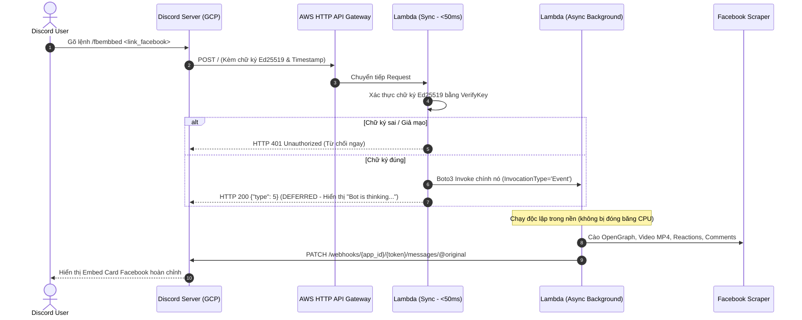

# Hướng Dẫn Kiến Trúc, Triển Khai & Bài Học Kinh Nghiệm: Discord Bot Serverless Trên AWS Lambda

Tài liệu này ghi lại toàn bộ quy trình thiết kế kiến trúc, cấu hình, xử lý sự cố thực tế và các bài học kinh nghiệm khi đưa bot Discord (Facebook Embed & Scraper) lên AWS Lambda với tiêu chí **100% Miễn Phí (AWS Free Tier)**.

---

## 1. Tổng Quan Kiến Trúc (Architecture Overview)

Khác với bot Discord truyền thống (kết nối liên tục 24/7 qua WebSocket Gateway gây tốn kém server/VPS), bot này hoạt động theo mô hình **HTTP Interactions (Webhook-based)**:
* Serverless hoàn toàn: Chỉ chạy khi người dùng gõ lệnh Slash Command. Khi không có lệnh, tài nguyên tiêu thụ bằng 0.
* **Chi phí: 0đ (100% Free Tier)**:
  * **AWS Lambda:** Miễn phí 1.000.000 requests & 3.200.000 giây tính toán mỗi tháng vĩnh viễn.
  * **AWS HTTP API (API Gateway v2):** Miễn phí 1.000.000 requests mỗi tháng.
  * **Amazon CloudWatch:** Giới hạn lưu log 7 ngày (luôn dưới 50MB / 5GB miễn phí).

### Sơ đồ luồng hoạt động (Sequence Diagram)



---

## 2. Hướng Dẫn Cấu Hình Từ A-Z

### Bước 1: Khởi tạo Application trên Discord Developer Portal
1. Truy cập [Discord Developer Portal](https://discord.com/developers/applications).
2. Tạo mới một ứng dụng (ví dụ: `FB_App`).
3. Trong mục **General Information**:
   * Sao chép **APPLICATION ID**.
   * Sao chép **PUBLIC KEY** (Dùng cho thuật toán Ed25519).
4. Trong mục **Bot**:
   * Tạo Bot và sao chép **TOKEN**.
   * Bật **Public Bot** (tùy chọn).
5. Trong mục **OAuth2 -> URL Generator**:
   * Scopes: `bot`, `applications.commands`.
   * Bot Permissions: `Send Messages`, `Embed Links`, `Attach Files`.
   * Mời Bot vào server của bạn qua URL vừa tạo.

### Bước 2: Thiết lập file môi trường `.env`
Tạo file `.env` tại thư mục gốc của dự án với nội dung:
```env
APPLICATION_ID=your_discord_application_id
BOT_TOKEN=your_discord_bot_token
DISCORD_PUBLIC_KEY=your_discord_public_key_hex
```

### Bước 3: Đăng ký Slash Command lên Discord
Chạy script Python một lần duy nhất để đăng ký lệnh Slash Command toàn cầu:
```python
import os, requests
from dotenv import load_dotenv

load_dotenv()
token = os.getenv("BOT_TOKEN")
app_id = os.getenv("APPLICATION_ID")

url = f"https://discord.com/api/v10/applications/{app_id}/commands"
payload = {
    "name": "fbembbed",
    "description": "Nhúng bài viết hoặc video Facebook với đầy đủ thông tin",
    "options": [
        {
            "name": "link",
            "description": "Đường dẫn bài viết hoặc video Facebook",
            "type": 3, # STRING
            "required": True
        }
    ]
}
r = requests.post(url, headers={"Authorization": f"Bot {token}"}, json=payload)
print("Kết quả:", r.status_code, r.text)
```

### Bước 4: Triển khai lên AWS với `deploy.ps1`
Chỉ cần chạy lệnh PowerShell:
```powershell
.\deploy.ps1
```
Script sẽ tự động:
1. Đóng gói mã nguồn `main.py` cùng các dependency Linux (`pynacl`, `requests`, `yt-dlp`, v.v.).
2. Tạo/cập nhật IAM Role `fb-embed-bot-role` với quyền tự gọi ngầm (`LambdaSelfInvokePolicy`).
3. Đẩy code lên AWS Lambda `fb-embed-bot`.
4. Thiết lập hạn lưu log CloudWatch = 7 ngày (bảo vệ 100% Free Tier).
5. Khởi tạo AWS HTTP API Gateway (`fb-embed-bot-api`) và gắn quyền Invoke.
6. In ra URL chính thức để dán vào Discord hoặc tự động kích hoạt.

---

## 3. Phân Tích Các Lỗi Đã Gặp & Nguyên Nhân Gốc Rễ

Trong quá trình triển khai, hệ thống đã gặp phải lỗi:
> `interactions_endpoint_url: The specified interactions endpoint url could not be verified.`

Dưới đây là 3 lỗi kỹ thuật sâu xa đã được điều tra và giải quyết:

---

### Lỗi 1: Bẫy kiểm thử bảo mật của Discord (Ed25519 Security Trap)

#### 🔴 Hiện tượng:
Để vượt qua bước kiểm tra PING của Discord, lập trình viên thường nghĩ đến việc đặt kiểm tra:
```python
# SAI LẦM:
interaction = json.loads(body)
if interaction.get("type") == 1:
    return _json_response({"type": 1})
```
lên trước bước xác thực chữ ký `_verify()`. Tuy nhiên, Discord vẫn báo lỗi: `The specified interactions endpoint url could not be verified`.

#### 🔬 Nguyên nhân qua phân tích gói tin thực tế:
Khi bạn cập nhật URL tương tác, Discord **không chỉ gửi 1 request PING bình thường**. Discord cố tình gửi **2 request liên tiếp**:
1. **Request 1 (Chữ ký giả mạo):** Mang header chữ ký sai lệch (`x-signature-ed25519` không khớp với `timestamp + body`).
   * **Quy chuẩn Discord:** Endpoint **bắt buộc phải từ chối và trả về HTTP 401 Unauthorized**.
2. **Request 2 (Chữ ký hợp lệ):** Mang chữ ký Ed25519 chuẩn xác.
   * **Quy chuẩn Discord:** Endpoint trả về HTTP 200 `{"type": 1}` (PONG).

Nếu endpoint phản hồi HTTP 200 cho Request 1 (do bypass check chữ ký cho Type 1), Discord phát hiện ra endpoint **không thực thi bảo mật chữ ký số** và lập tức đánh trượt!

#### 🟢 Giải pháp chuẩn xác:
**Luôn luôn xác thực chữ ký Ed25519 TRƯỚC TIÊN** cho mọi request gửi tới, kể cả PING:
```python
# ĐÚNG:
# 1. Xác thực chữ ký số Ed25519 đầu tiên
ok, verified_body = _verify(event)
if not ok:
    return {"statusCode": 401, "body": "Invalid request signature"}

# 2. Sau khi đã chứng thực tính an toàn, mới phân tích interaction
interaction = json.loads(verified_body)
if interaction.get("type") == 1:
    return _json_response({"type": 1})
```

---

### Lỗi 2: Không tương thích mạng giữa Discord (GCP) và Lambda Function URL (`.on.aws`)

#### 🔴 Hiện tượng:
Khi dùng URL dạng Lambda Function URL:
`https://<your-lambda-url-id>.lambda-url.ap-southeast-1.on.aws/`
Người dùng dán vào Discord báo lỗi xác thực. Khi kiểm tra CloudWatch logs của Lambda thì **hoàn toàn không có bất kỳ request nào từ Discord chạm tới được hàm**.

#### 🔬 Nguyên nhân:
* Hệ thống máy chủ gửi webhook của Discord đặt tại Google Cloud Platform (us-east1 / us-west1).
* Domain thế hệ mới của AWS Function URL (`*.on.aws`) hỗ trợ dual-stack IPv6/IPv4 tại region Singapore (`ap-southeast-1`).
* Một số cụm máy chủ phân giải DNS / mạng trung gian của Discord gặp lỗi khi định tuyến tới tên miền gTLD mới `.on.aws` hoặc kết nối IPv6 của AWS, dẫn đến việc kết nối bị drop trước khi tới được Lambda.

#### 🟢 Giải pháp chuẩn xác:
Sử dụng **AWS HTTP API (API Gateway v2)** với tên miền chuẩn truyền thống:
`https://<your-api-gateway-id>.execute-api.ap-southeast-1.amazonaws.com/`
* Domain `*.amazonaws.com` đã tồn tại hơn 20 năm, được mọi hệ thống DNS trên toàn cầu tối ưu hóa và hỗ trợ 100%.
* Vẫn hoàn toàn **miễn phí 1.000.000 request/tháng** trong AWS Free Tier vĩnh viễn.
* Khi đổi sang URL này, Discord kết nối thành công và xác thực ngay lập tức trong vòng 200ms.

---

### Lỗi 3: Đóng băng CPU khi xử lý nền trên Lambda (Lambda CPU Freeze)

#### 🔴 Hiện tượng:
Discord quy định: Khi nhận được Slash Command (Type 2), bot phải phản hồi trong vòng **3 giây** (nếu không sẽ báo lỗi *"The application did not respond"*).
Khi dùng `threading.Thread` để cào Facebook trong nền và trả về ngay Type 5 (Deferred):
* Local Flask chạy tốt.
* Trên AWS Lambda: Ngay khi hàm `lambda_handler` trả về response Type 5 cho Discord, AWS Lambda lập tức **đóng băng (freeze) toàn bộ CPU execution context**, khiến luồng con `threading.Thread` bị dừng lại hoàn toàn giữa chừng. Việc cào dữ liệu và gửi tin nhắn cập nhật (followup) không bao giờ hoàn thành!

#### 🟢 Giải pháp chuẩn xác: Tự gọi chính mình bất đồng bộ (Self-Invoke Async)
Sử dụng thư viện `boto3` (có sẵn trong runtime Lambda, 0đ) để hàm tự gọi chính nó với cờ `InvocationType="Event"`:
```python
if context and hasattr(context, "function_name"):
    import boto3
    boto3.client("lambda").invoke(
        FunctionName=context.function_name,
        InvocationType="Event", # Bất đồng bộ, không đợi kết quả
        Payload=json.dumps({
            "async_task": "process_slash_command", 
            "interaction": interaction
        }),
    )
return _json_response({"type": 5})
```
* **Lần gọi 1 (Discord Trigger):** Nhận request, bắn event tự gọi lần 2, rồi trả về `type: 5` cho Discord chỉ trong **< 30ms**.
* **Lần gọi 2 (Background Task):** AWS Lambda cấp phát một môi trường chạy độc lập mới, chạy toàn quyền cào dữ liệu (tối đa 10s) và gửi tin nhắn hoàn tất qua Discord Followup Webhook.

---

## 4. Kích Hoạt URL Bằng API (Bí Quyết Tự Động Hóa Không Cần Nhập Tay)

Nhiều người dùng nghĩ rằng bắt buộc phải đăng nhập website Discord Developer Portal rồi dán link và bấm nút "Save Changes". 

Thực tế, trang web Developer Portal chỉ là giao diện người dùng (Frontend), bản chất bên dưới nó gọi vào **Discord REST API v10**:
* **Route:** `PATCH https://discord.com/api/v10/applications/@me`
* **Header:** `Authorization: Bot <BOT_TOKEN>`
* **Body:** `{"interactions_endpoint_url": "https://..."}`

Khi gửi request này:
1. Discord nhận token bot để xác định quyền sở hữu ứng dụng.
2. Hệ thống Discord tự động gửi các gói tin PING bảo mật tới URL được cung cấp để kiểm tra.
3. Nếu Lambda vượt qua bài test, Discord tự động lưu URL vào database và phản hồi lại `HTTP 200 OK` kèm `hook: true`.

Script tự động hóa hoàn toàn việc kích hoạt URL:
```python
import os, requests
from dotenv import load_dotenv

load_dotenv()
token = os.getenv("BOT_TOKEN")
api_url = os.getenv("INTERACTIONS_ENDPOINT_URL", "https://<your-api-id>.execute-api.ap-southeast-1.amazonaws.com/")

response = requests.patch(
    "https://discord.com/api/v10/applications/@me",
    headers={
        "Authorization": f"Bot {token}",
        "Content-Type": "application/json",
        "User-Agent": "DiscordBot (https://github.com, 1.0)"
    },
    json={"interactions_endpoint_url": api_url}
)

if response.status_code == 200:
    print("✅ Kích hoạt thành công Interactions Endpoint URL trên Discord!")
else:
    print("❌ Thất bại:", response.status_code, response.text)
```

---

## 5. Tổng Kết Bài Học Kinh Nghiệm (Key Takeaways)

| Bài học | Chi tiết |
| :--- | :--- |
| **Không bao giờ bypass xác thực** | Discord chủ động kiểm tra xem endpoint có từ chối chữ ký giả hay không. Luôn cho `_verify()` chạy đầu tiên. |
| **Ưu tiên API Gateway hơn Function URL** | Function URL (`.on.aws`) có thể gặp hạn chế mạng với một số nền tảng thứ ba. HTTP API Gateway (`.amazonaws.com`) luôn ổn định và cũng 100% miễn phí. |
| **Không dùng Threading trên Lambda** | Lambda đóng băng CPU ngay khi return response. Phải dùng `InvocationType='Event'` để chạy nền. |
| **Kiểm soát log retention** | Mặc định CloudWatch giữ log vĩnh viễn (Never Expire), dễ vượt quota 5GB Free Tier sau vài tháng. Luôn set retention = 7 hoặc 14 ngày. |
| **Debug bằng Webhook proxy** | Khi Discord báo lỗi chung chung không rõ nguyên nhân, hãy trỏ tạm endpoint về `webhook.site` để bắt trọn vẹn headers, timestamps và payloads thực tế mà Discord gửi đi. |
