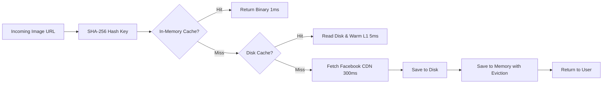
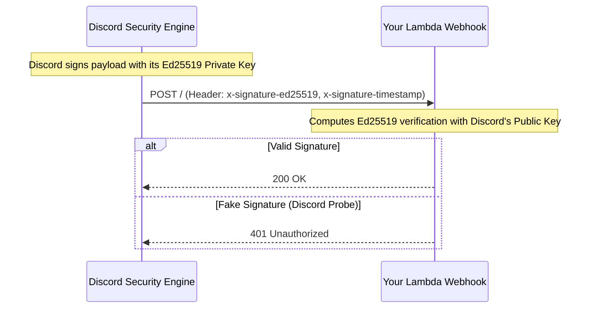
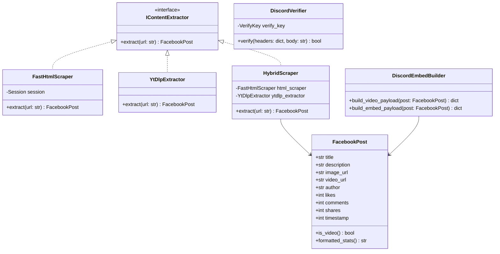

# 🎓 MASTERCLASS: ARCHITECTURE, ALGORITHMS & OOP IN PYTHON
## Hướng Dẫn Chuyên Sâu: Kiến Trúc, Thuật Toán & Lập Trình Hướng Đối Tượng Python Qua Dự Án Facebook Discord Bot

> **Target Audience:** Python Developer moving from Junior/Mid to Senior level.  
> **Approach:** Dual-lens — Senior Software Architect (system design, trade-offs) + CS Teacher (first principles, clear explanations).  
> **Language:** Bilingual (English & Vietnamese / Song ngữ Anh - Việt).

---

## 📑 TABLE OF CONTENTS / MỤC LỤC
1. [System Architecture & Design Paradigms / Kiến Trúc Hệ Thống & Mô Hình Thiết Kế](#1-system-architecture--design-paradigms)
2. [Concurrency & The Lambda Execution Model / Xử Lý Bất Đồng Bộ & Mô Hình Lambda](#2-concurrency--the-lambda-execution-model)
3. [Algorithms & Data Structures in Production / Giải Thuật & Cấu Trúc Dữ Liệu Thực Chiến](#3-algorithms--data-structures-in-production)
4. [Web Security & Cryptography / Mật Mã Học & Bảo Mật Web](#4-web-security--cryptography)
5. [Refactoring to OOP & Design Patterns / Tái Cấu Trúc Hướng Đối Tượng & Design Patterns](#5-refactoring-to-oop--design-patterns)
6. [Advanced Python Engineering Skills / Kỹ Năng Lập Trình Python Chuyên Nghiệp](#6-advanced-python-engineering-skills)
7. [Summary & Learning Roadmap / Bảng Tổng Hợp & Lộ Trình Nâng Cao Năng Lực](#7-summary--learning-roadmap)

---

## 1. System Architecture & Design Paradigms
### Kiến Trúc Hệ Thống & Mô Hình Thiết Kế

```mermaid
graph TD
    subgraph Discord Client
        User[Discord User] -->|1. /fbembbed link| DCServer[Discord Gateway Server]
    end

    subgraph AWS Cloud Serverless
        DCServer -->|2. POST with Ed25519 Headers| APIGW[AWS HTTP API Gateway]
        APIGW -->|3. Proxy Request| LSync[Lambda Execution 1: Sync Handler]
        LSync -->|4. Ed25519 Verify| Verify{Signature OK?}
        Verify -- No -->|401 Unauthorized| DCServer
        Verify -- Yes -->|5. Boto3 Event Invoke| LAsync[Lambda Execution 2: Background Task]
        LSync -->|6. Fast ACK: Type 5 Deferred < 50ms| DCServer
        
        LAsync -->|7. Fast Scrape & ytdlp| FB[Facebook Web / CDN]
        LAsync -->|8. Webhook Followup PATCH| DiscordAPI[Discord REST API v10]
    end

    DiscordAPI -->|9. Render Card / Video| User
```

#### 🇬🇧 English Explanation
Traditional Discord bots (e.g., built with `discord.py`) use **Long-Lived WebSockets (Gateway)**. The bot maintains a persistent TCP connection 24/7 to Discord servers:
* **Pros:** Real-time event dispatching, simple state management in memory.
* **Cons:** Idle cost (requires a VPS/EC2 running 24/7), socket reconnection handling, state loss on crash.

Your bot adopts the **Webhook-based Interactions Model (Serverless)**:
* **Request-Response (Pull/Push):** Discord treats your endpoint as an HTTP webhook. No long-running process is active when no commands are executed.
* **Economic Advantage:** 100% free under AWS Free Tier (1,000,000 invocations/month).
* **Architecture Challenge:** Discord enforces a strict **3-second timeout rule**. If your HTTP endpoint fails to respond within 3000ms, Discord cancels the interaction with `"The application did not respond"`.

#### 🇻🇳 Giải Thích Tiếng Việt
Các bot Discord truyền thống (thường viết bằng `discord.py`) dùng kết nối **WebSocket liên tục (Gateway)**. Bot phải duy trì kết nối mạng 24/7 với Discord:
* **Ưu điểm:** Nhận sự kiện thời gian thực, lưu trữ biến tạm dễ dàng trong RAM.
* **Nhược điểm:** Tốn kém tiền duy trì máy chủ (VPS/EC2), phức tạp khi mạng đứt và phải tự phục hồi kết nối.

Dự án của bạn áp dụng mô hình **Tương tác qua Webhook (Serverless)**:
* **Mô hình Hướng sự kiện (Event-Driven):** Discord đóng vai trò là Client gửi HTTP POST tới Webhook của bạn. Bot chỉ chạy khi có người gõ lệnh Slash Command.
* **Tối ưu chi phí:** Đạt tiêu chí 0đ (100% Free Tier vĩnh viễn với 1.000.000 lượt gọi/tháng).
* **Thách thức kiến trúc:** Ràng buộc thời gian 3 giây (**3-second timeout**) của Discord. Nếu endpoint không trả lời trong 3 giây, Discord sẽ coi lệnh đã chết.

---

## 2. Concurrency & The Lambda Execution Model
### Xử Lý Bất Đồng Bộ & Mô Hình Lambda

### The Pitfall: Local Threading vs AWS Lambda Freeze
#### Cái Bẫy: Luồng Con Local vs Hiện Tượng Đóng Băng CPU Trên Lambda

In [app.py](file:///C:/Dream/Discord/Facebook_bot/app.py) & [main.py](file:///C:/Dream/Discord/Facebook_bot/main.py#L700-L704), local development uses Python's standard `threading.Thread`:

```python
# Works locally with Flask, but FAILS on AWS Lambda!
threading.Thread(target=_process_slash_command, args=(interaction,), daemon=True).start()
return _json_response({"type": 5})
```

#### 🇬🇧 Why does this fail on Serverless?
1. **CPU Freezing:** When a Serverless function finishes returning its HTTP response payload, the cloud runtime (AWS Firecracker microVM) immediately suspends the CPU execution context to prevent unmetered computing.
2. **Result:** The child thread spawned by `threading.Thread` is instantly paused in memory mid-execution. The HTTP scraping to Facebook is aborted or frozen indefinitely until another random request triggers the container, causing erratic ghost executions.

#### 🇻🇳 Tại sao cách này thất bại trên Serverless?
1. **Cơ chế đóng băng CPU (CPU Throttling & Freezing):** Khi hàm Lambda trả về kết quả HTTP response, hệ thống máy ảo của AWS (Firecracker microVM) lập tức **đóng băng toàn bộ CPU** để không cho tiến trình chạy ngầm vô tội vạ.
2. **Hậu quả:** Luồng `threading.Thread` vừa khởi chạy liền bị "ngủ đông". Việc cào Facebook và gửi tin nhắn cập nhật Webhook không bao giờ tới đích.

---

### The Solution: Asynchronous Self-Invocation Pattern
### Giải Pháp: Mô Hình Tự Kích Hoạt Bất Đồng Bộ (Self-Invocation)

Xem [main.py](file:///C:/Dream/Discord/Facebook_bot/main.py#L690-L697):

```python
import boto3

boto3.client("lambda").invoke(
    FunctionName=context.function_name,
    InvocationType="Event",  # Asynchronous execution
    Payload=json.dumps({
        "async_task": "process_slash_command", 
        "interaction": interaction
    }),
)
return _json_response({"type": 5})  # Fast ACK within < 50ms
```

| Dimension / Tiêu chí | `InvocationType='RequestResponse'` (Sync) | `InvocationType='Event'` (Async) |
| :--- | :--- | :--- |
| **Execution Mode** | Block waiting for response / Đợi hàm chạy xong | Fire-and-forget / Kích hoạt xong bỏ qua |
| **Response Time** | Dependent on workload (2 - 10s) | Instant (< 30ms) |
| **Cost / Resource** | Duplicates billing time / Trùng lặp thời gian tính tiền | Independent execution / Tách biệt hoàn toàn |
| **Discord Timeout** | Likely to exceed 3s -> ❌ Failed | Completes in < 50ms -> ✅ Success |

> [!TIP]
> **Design Pattern Name:** This is an implementation of the **Asynchronous Command Dispatcher Pattern** coupled with **Deferred Interaction Handling**.

---

## 3. Algorithms & Data Structures in Production
### Giải Thuật & Cấu Trúc Dữ Liệu Thực Chiến

Trong dự án này, bạn sử dụng nhiều giải thuật thú vị từ xử lý văn bản (String processing), tìm kiếm mẫu (Pattern matching) đến bộ nhớ đệm (Caching).

---

### 3.1. Text Chunking Algorithm (Chia Khối Văn Bản Ngữ Nghĩa)
Xem hàm [_chunk_text](file:///C:/Dream/Discord/Facebook_bot/main.py#L182-L212):

```python
def _chunk_text(text: str, max_chunk_size: int = 3800) -> list:
    if not text or len(text) <= max_chunk_size:
        return [text] if text else []

    chunks = []
    current_text = text
    while len(current_text) > max_chunk_size:
        split_idx = current_text.rfind("\n\n", 0, max_chunk_size)
        if split_idx == -1:
            split_idx = current_text.rfind("\n", 0, max_chunk_size)
        if split_idx == -1:
            split_idx = current_text.rfind(". ", 0, max_chunk_size)
            if split_idx != -1:
                split_idx += 1
        if split_idx == -1:
            split_idx = current_text.rfind(" ", 0, max_chunk_size)
        if split_idx == -1:
            split_idx = max_chunk_size

        chunks.append(current_text[:split_idx].strip())
        current_text = current_text[split_idx:].strip()

    if current_text:
        chunks.append(current_text)

    return chunks
```

#### 🇬🇧 Theoretical Breakdown
* **Problem:** Discord Embed descriptions have a strict hard limit of 4096 characters (safe threshold is ~3800 to leave room for footers and metadata). Naive slicing `text[:3800]` cuts words and sentences in half (e.g. `"inter"` ... `"national"`), ruining user readability.
* **Algorithmic Strategy:** **Greedy Backward Search with Fallback Hierarchy**:
  1. Priority 1: Double newline `\n\n` (Paragraph boundary).
  2. Priority 2: Single newline `\n` (Line break).
  3. Priority 3: Sentence end `. ` (Sentence boundary).
  4. Priority 4: Word space `' '` (Word boundary).
  5. Fallback: Hard cut at `max_chunk_size` (Worst case when a user pastes a string with no spaces).
* **Complexity:**
  * **Time Complexity:** $\mathcal{O}(N)$ where $N$ is text length. Each character is scanned a constant number of times via `rfind`.
  * **Space Complexity:** $\mathcal{O}(N)$ to construct chunk slices.

#### 🇻🇳 Phân Tích Lý Thuyết
* **Bài toán:** Embed của Discord giới hạn tối đa 4096 ký tự. Cắt thô bằng `text[:3800]` sẽ làm đứt đôi từ ngữ hoặc câu văn.
* **Chiến lược thuật toán:** **Tìm kiếm lùi tham lam (Greedy Backward Search)** theo thứ tự ưu tiên ngữ nghĩa giảm dần:
  1. Xuống dòng kép `\n\n` (Kết thúc đoạn văn).
  2. Xuống dòng đơn `\n` (Hết dòng).
  3. Dấu chấm kết câu `. ` (Hết câu).
  4. Khoảng trắng `' '` (Hết từ).
  5. Phương án cuối: Cắt cưỡng bức ở vị trí 3800 nếu gặp chuỗi dài vô tận không dấu cách.

---

### 3.2. Two-Tier Caching & Eviction (Bộ Nhớ Đệm Hai Tầng)
Xem [media_proxy.py](file:///C:/Dream/Discord/Facebook_bot/embed_card/media_proxy.py#L22-L32):



#### 🇬🇧 Algorithms & Concepts
1. **Deterministic Key Generation via Cryptographic Hash:**
   $$\text{Key} = \text{SHA256}(\text{URL})$$
   * URLs can be arbitrary length (up to 2000+ characters) with special symbols forbidden in filesystem filenames (`?`, `&`, `/`, `:`).
   * SHA-256 reduces any URL to a fixed 64-character hexadecimal string, guaranteeing safe file paths on disk and $\mathcal{O}(1)$ dictionary lookup keys in memory.
2. **LRU / FIFO Eviction Algorithm:**
   ```python
   if len(_MEMORY_CACHE) >= MAX_MEMORY_ITEMS:
       # Sort keys by timestamp and prune the oldest 50 items
       old_keys = sorted(_MEMORY_CACHE.keys(), key=lambda k: _MEMORY_CACHE[k]["timestamp"])[:50]
       for k in old_keys:
           del _MEMORY_CACHE[k]
   ```
   * **Why?** Unbounded caching in RAM causes `OutOfMemoryError` (OOM).
   * Evicting in batches of 50 amortizes sorting overhead instead of sorting on every single insertion.

#### 🇻🇳 Thuật Toán & Khái Niệm
1. **Tạo Khóa Xác Định Bằng Hàm Băm:**
   * URL chứa các ký tự đặc biệt không thể dùng làm tên file trên ổ đĩa (`/`, `?`, `&`).
   * Băm URL thành mã SHA-256 biến mọi link dài ngắn bất kỳ thành chuỗi cố định 64 ký tự, tra cứu trong Dictionary với tốc độ $\mathcal{O}(1)$.
2. **Thuật toán giải phóng bộ nhớ (Eviction):**
   * Giới hạn RAM tối đa `MAX_MEMORY_ITEMS = 300`. Khi đầy, lọc ra 50 mục cũ nhất theo thời gian truy cập để dọn dẹp, bảo vệ bot không bị tràn RAM dẫn tới crash.

---

## 4. Web Security & Cryptography
### Mật Mã Học & Bảo Mật Web

### 4.1. Ed25519 Digital Signature Verification
Xem hàm [_verify](file:///C:/Dream/Discord/Facebook_bot/main.py#L82-L110):

```python
verify_key.verify(f"{timestamp}{body}".encode(), bytes.fromhex(signature))
```



#### 🇬🇧 Cryptographic Foundations
* **Asymmetric Cryptography:** Discord holds a **Private Signing Key**. You configure your bot with Discord's **Public Verification Key**.
* **Ed25519 Algorithm:** A Twisted Edwards curve public-key signature system ($2^{255} - 19$).
  * Provides high security (~128-bit security level) with tiny key sizes (32 bytes) and very fast signing/verification times (< 1ms).
  * Replaces legacy RSA or HMAC-SHA256 because it is immune to cache-timing attacks and side-channel vulnerabilities.
* **Why Timestamp in Payload?** `f"{timestamp}{body}"` prevents **Replay Attacks**. An attacker eavesdropping on a network cannot capture an old valid payload and re-submit it later.

#### 🇻🇳 Nền Tảng Mật Mã Học
* **Mật mã bất đối xứng (Asymmetric Cryptography):** Discord giữ **Khóa Bí Mật (Private Key)** để ký tên. Bạn giữ **Khóa Công Khai (Public Key)** để xác minh tính chính danh.
* **Thuật toán Ed25519:** Sử dụng đường cong Elliptic Edwards, kích thước khóa siêu nhỏ gọn (chỉ 32 bytes) nhưng tốc độ xác thực nhanh gấp nhiều lần so với RSA truyền thống.
* **Tại sao phải ghép Timestamp vào Body?** Nhằm chống lại kiểu tấn công phát lại (**Replay Attack**). Kẻ xấu dù bắt được gói tin trên đường truyền cũng không thể gửi lại gói tin cũ vì timestamp sẽ bị lệch.

---

### 4.2. SSRF Defense (Server-Side Request Forgery)
Xem hàm [_is_safe_url](file:///C:/Dream/Discord/Facebook_bot/embed_card/media_proxy.py#L48-L75):

```python
import ipaddress
from urllib.parse import urlparse

def _is_safe_url(url: str) -> bool:
    parsed = urlparse(url)
    if parsed.scheme not in ("http", "https"):
        return False
    hostname = parsed.hostname
    try:
        ip = ipaddress.ip_address(hostname)
        if ip.is_private or ip.is_loopback or ip.is_link_local:
            return False
    except ValueError:
        pass  # Hostname is a valid domain name
    return True
```

#### 🇬🇧 Security Concept: SSRF
* **Threat:** When a proxy accepts a URL from user input, an attacker might pass `http://169.254.169.254/latest/meta-data/` (AWS EC2/Lambda Instance Metadata Service) to steal cloud credentials or database passwords!
* **Defense:** Parse the IP and reject private ranges (`10.0.0.0/8`, `192.168.0.0/16`, `127.0.0.1`, and link-local `169.254.0.0/16`).

#### 🇻🇳 Khái Niệm An Toàn: Lỗ Hổng SSRF
* **Mối nguy hiểm:** Kẻ tấn công có thể truyền URL trỏ về mạng nội bộ như `http://169.254.169.254/latest/meta-data/` (địa chỉ metadata của AWS) để đánh cắp IAM credentials, hoặc trỏ về `127.0.0.1:5000` để đọc trộm tài nguyên bí mật.
* **Cơ chế phòng thủ:** Thư viện `ipaddress` của Python kiểm tra và lập tức chặn đứng các dải IP nội bộ, loopback và link-local.

---

## 5. Refactoring to OOP & Design Patterns
### Tái Cấu Trúc Hướng Đối Tượng & Design Patterns

Hiện tại mã nguồn trong [main.py](file:///C:/Dream/Discord/Facebook_bot/main.py) đang được viết theo phong cách **Lập trình thủ tục (Procedural Programming)** với các hàm độc lập và biến toàn cục (`http_session`, `verify_key`).

Để trở thành một **Senior Python Developer**, bạn cần thành thạo việc chuyển đổi tư duy sang **Object-Oriented Programming (OOP)** và áp dụng các **Design Patterns** kinh điển.

---

### 5.1. Procedural vs Object-Oriented Comparison
| Procedural Code (Hiện Tại) | Object-Oriented Code (Senior Level) |
| :--- | :--- |
| Dữ liệu là các Dictionary trần trụi (`dict`) không rõ kiểu. | Dữ liệu được đóng gói vào **Data Classes** / **Pydantic Models** có kiểu rõ ràng. |
| Các hàm xử lý phụ thuộc vào biến toàn cục (`verify_key`, `APPLICATION_ID`). | Phụ thuộc được truyền qua **Constructor Injection (Dependency Injection)**. |
| Khó viết Unit Test vì không thể Mock các hàm độc lập dễ dàng. | Dễ dàng Mock và viết Unit Test nhờ kế thừa hoặc Interface. |
| Vi phạm nguyên lý Single Responsibility Principle (SRP). | Mỗi Class đảm nhận một trách nhiệm duy nhất. |

---

### 5.2. Concrete Architecture Refactor Blueprint

Dưới đây là thiết kế kiến trúc chuẩn OOP cho toàn bộ bot:



---

### 5.3. Implementation Code Example (Clean OOP)

#### A. Encapsulating Data with `dataclass`
Thay vì dùng `dict` lỏng lẻo, ta tạo một Model có Type Annotation và phương thức bổ trợ:

```python
from dataclasses import dataclass
from typing import Optional
import datetime
import time

@dataclass(frozen=True)
class FacebookPost:
    url: str
    title: Optional[str] = None
    description: Optional[str] = None
    image_url: Optional[str] = None
    video_url: Optional[str] = None
    author: Optional[str] = None
    likes: Optional[int] = None
    comments: Optional[int] = None
    shares: Optional[int] = None
    timestamp: Optional[float] = None

    @property
    def is_video(self) -> bool:
        """Encapsulated business logic / Đóng gói logic nghiệp vụ"""
        return bool(self.video_url)

    def time_ago(self) -> str:
        """Calculate relative time / Tính toán thời gian tương đối"""
        if not self.timestamp:
            return ""
        diff = max(0, int(time.time() - self.timestamp))
        if diff < 60: return "Vừa xong"
        if diff < 3600: return f"{diff // 60} phút trước"
        if diff < 86400: return f"{diff // 3600} giờ trước"
        return f"{diff // 86400} ngày trước"
```

#### B. Strategy & Composite Pattern: `IContentExtractor` & `HybridScraper`
Thay vì nhét `yt-dlp` và BeautifulSoup chung một hàm dài 150 dòng, ta tách thành các Strategy riêng biệt:

```python
from abc import ABC, abstractmethod

class ContentExtractorStrategy(ABC):
    """Abstract Base Class (Interface)"""
    @abstractmethod
    def extract(self, url: str) -> Optional[FacebookPost]:
        pass

class YtDlpStrategy(ContentExtractorStrategy):
    """Responsible only for video/reel media stream extraction"""
    def extract(self, url: str) -> Optional[FacebookPost]:
        # yt-dlp implementation details...
        pass

class OpenGraphStrategy(ContentExtractorStrategy):
    """Responsible only for fast HTML OpenGraph scraping"""
    def __init__(self, session=None):
        self.session = session or requests.Session()

    def extract(self, url: str) -> Optional[FacebookPost]:
        # Fast HTML & Relay JSON scraping...
        pass

class HybridFacebookExtractor(ContentExtractorStrategy):
    """
    Composite Pattern / Fallback Chain
    Orchestrates multiple strategies smoothly
    """
    def __init__(self, fast_strategy: OpenGraphStrategy, video_strategy: YtDlpStrategy):
        self.fast_strategy = fast_strategy
        self.video_strategy = video_strategy

    def extract(self, url: str) -> FacebookPost:
        if "/reel/" in url or "/watch/" in url or "/videos/" in url:
            video_post = self.video_strategy.extract(url)
            if video_post and video_post.video_url:
                return video_post
        return self.fast_strategy.extract(url)
```

> [!NOTE]
> **OOP Principles Applied (SOLID):**
> * **S - Single Responsibility:** `OpenGraphStrategy` chỉ quan tâm đến HTML; `YtDlpStrategy` chỉ quan tâm đến Video.
> * **O - Open/Closed:** Nếu Facebook ra mắt định dạng mới (e.g. Threads, Instagram Reels), ta chỉ cần viết thêm `InstagramStrategy` mà không sửa đổi mã nguồn cũ!
> * **D - Dependency Inversion:** Các module cấp cao phụ thuộc vào Interface `ContentExtractorStrategy`, không phụ thuộc vào chi tiết cài đặt cụ thể.

---

## 6. Advanced Python Engineering Skills
### Kỹ Năng Lập Trình Python Chuyên Nghiệp

Dưới đây là các kỹ năng cốt lõi giúp bạn tự tin phỏng vấn và làm việc trong các dự án công nghệ lớn:

### 6.1. Connection Pooling & Resource Management
Xem dòng 39 của [main.py](file:///C:/Dream/Discord/Facebook_bot/main.py#L39):
```python
http_session = requests.Session()
```
* **Tại sao không dùng `requests.get()` trực tiếp?**
  * Mỗi lần gọi `requests.get()` là hệ thống phải thực hiện lại bắt tay TCP 3 bước (3-way handshake) và bắt tay mã hóa TLS/SSL. Quá trình này ngốn từ 150ms đến 500ms mỗi request.
  * `requests.Session()` kích hoạt cơ chế **HTTP Keep-Alive** và **Connection Pooling** (thông qua thư viện `urllib3`), tái sử dụng socket có sẵn, giảm độ trễ mạng xuống tới **70%**.

### 6.2. Regex Pre-compilation (`re.compile`)
Xem dòng 33 của [main.py](file:///C:/Dream/Discord/Facebook_bot/main.py#L33):
```python
FB_URL_REGEX = re.compile(
    r"(https?://(?:www\.|m\.|web\.|mbasic\.)?(?:facebook\.com|fb\.watch)/\S+)",
    re.IGNORECASE,
)
```
* `re.compile()` biên dịch chuỗi biểu thức chính quy thành mã bytecode trong bộ nhớ C ngay khi module được load. Khi hàng ngàn request ùa vào, Python chỉ việc khớp bytecode với độ phức tạp tối ưu thay vì phải phân tích cú pháp regex từ đầu.

### 6.3. Unit Testing & Mocking Framework
Là một kỹ sư cao cấp, không thể thiếu kiểm thử tự động (Automated Testing). Bạn có thể test logic cắt đoạn văn bản mà không cần gọi mạng:

```python
# test_text_chunking.py
import pytest
from main import _chunk_text

def test_short_text_returns_single_chunk():
    text = "Hello world"
    chunks = _chunk_text(text, max_chunk_size=100)
    assert chunks == ["Hello world"]

def test_chunking_respects_paragraphs():
    p1 = "A" * 50
    p2 = "B" * 50
    text = f"{p1}\n\n{p2}"
    chunks = _chunk_text(text, max_chunk_size=60)
    assert len(chunks) == 2
    assert chunks[0] == p1
    assert chunks[1] == p2
```

---

## 7. Summary & Learning Roadmap
### Bảng Tổng Hợp & Lộ Trình Nâng Cao Năng Lực

| Lĩnh vực (Domain) | Khái niệm đã áp dụng trong Bot | Hướng đi tiếp theo (Next Step) |
| :--- | :--- | :--- |
| **System Architecture** | Serverless Webhooks, AWS API Gateway, Event-Driven | Microservices, Event Sourcing, Message Queues (SQS/Kafka) |
| **Concurrency** | Boto3 Async Lambda Invoke, Multi-threading | Python `asyncio` (`aiohttp`, `asyncpg`), Celery worker queues |
| **Algorithms** | Greedy backward text chunking, SHA-256 caching | Dynamic Programming, Graph traversal, Tokenizer chunking (LLMs) |
| **Security** | Ed25519 Elliptic Curve Signatures, SSRF Filtering | OAuth2/OIDC, Rate Limiting (Token Bucket), JWT verification |
| **OOP & Patterns** | Procedural scripting to Dataclasses, Strategy Pattern | Domain-Driven Design (DDD), Clean Architecture, Hexagonal Pattern |

---
*Tài liệu được biên soạn độc quyền cho dự án Facebook Discord Bot. Hãy lưu lại và dùng làm cẩm nang kiến thức khi phát triển các hệ thống Backend & Cloud tiếp theo của bạn!*
