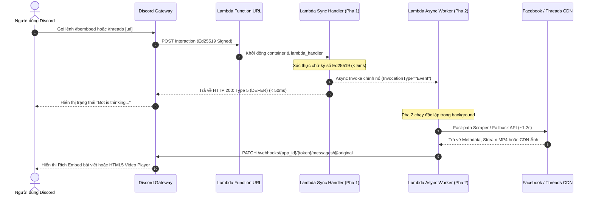

# FACEBOOK & THREADS EMBED DISCORD BOT (HYBRID ARCHITECTURE)
> Bot Discord tự động nhúng và trích xuất nội dung bài viết, video từ **Facebook** và **Threads (Meta)** dưới dạng Rich Embeds chuẩn nhận diện thương hiệu, hỗ trợ cả kiến trúc Serverless trên AWS Lambda và Discord.py Cog.

**Phiên bản:** 2.2.1 (Hotfix Mobile Share Links)  
**Ngày cập nhật cuối (Last Updated):** 2026-09-10  
**Runtime:** Python 3.12+ (AWS Lambda x86_64 / Local Gateway)

---

## 1. CÁC TÍNH NĂNG CHÍNH (KEY FEATURES)

1. **Nhúng bài viết Facebook (`/fbembbed [url]`):**
   - Trích xuất trực tiếp MP4 video stream qua Fast-Path Regex (< 1.5s).
   - Tự động fallback sang `yt-dlp` cho các video phức tạp.
   - Hiển thị thống kê tương tác (Likes, Comments, Shares) và giao diện Embed khung xanh Facebook (`0x1877F2`).
2. **Nhúng bài viết Threads (`/threads [url]` hoặc alias `/th [url]`):**
   - **Hỗ trợ mọi định dạng URL:** Chuẩn hóa toàn bộ URL bài viết (`@user/post/xxxx`), liên kết rút gọn (`/t/xxxx`, `/post/xxxx`) và **liên kết chia sẻ từ ứng dụng di động** (`/share/xxxx` với HTTP 302 Pre-Resolution).
   - **Layered Fallback 3 tầng:** Fast-Path Meta Scraper (`facebookexternalhit/1.1`) -> Tokenless Official oEmbed (`graph.threads.net/oembed`) -> Graceful Minimal Fallback.
   - **SSRF Protection:** Whitelist nghiêm ngặt tên miền (`threads.net`, `threads.com`).
   - **In-Memory TTL Caching:** Lưu bộ nhớ đệm kép (10 phút cho Post, 1 giờ cho Avatar tác giả) chống rate-limit.
   - **Discord Image Gallery Grid:** Tự động chia bài viết nhiều ảnh (carousel) thành tối đa 4 embeds cùng URL để Discord hiển thị lưới ảnh trực quan.
   - **Dark Theme Chuẩn Threads:** Embed tông màu `#101010` kèm nút bấm `🔗 Xem bài viết gốc` và `👤 Xem trang cá nhân`.

---

## 2. CẤU TRÚC HỆ THỐNG (SYSTEM ARCHITECTURE)

Hệ thống hoạt động theo mô hình 2 pha (**Two-Phase Serverless Asynchronous Execution**) nhằm đáp ứng yêu cầu phản hồi tương tác trong vòng **3.0 giây** của Discord Gateway và tránh tình trạng container đóng băng (freezing):



---

## 3. CẤU TRÚC THƯ MỤC DỰ ÁN (PROJECT STRUCTURE)

```text
Facebook_bot/
├── main.py                     # Entrypoint Lambda handler, xác thực chữ ký & router xử lý ngầm
├── app.py                      # Flask server phục vụ môi trường chạy thử nghiệm local
├── bot.py                      # Kịch bản bulk register slash commands (/fbembbed, /threads, /th)
├── deploy.ps1                  # Kịch bản tự động hóa đóng gói và triển khai AWS Lambda
├── threads_fetcher.py          # Core engine fetch Threads với Layered Fallback & In-Memory TTL Cache
├── threads_embed_builder.py    # Xây dựng Discord Rich Embeds & Action View nút bấm chuẩn Threads
├── cogs/                       # Thư mục Discord.py Cogs
│   ├── __init__.py
│   └── threads_embed.py        # Cog slash command /threads & /th cho bot discord.py
├── requirements-lambda.txt     # Danh sách thư viện tối giản đóng gói lên Lambda
├── requirements.txt            # Danh sách thư viện đầy đủ cho môi trường dev local
├── tests/                      # Thư mục kiểm thử tự động (62 Pytest Cases)
│   ├── __init__.py
│   ├── conftest.py             # Fixtures sinh khóa Ed25519 & mock biến môi trường
│   ├── test_fast_path.py       # [v2.1] Kiểm thử bóc tách Fast-Path & Fallback yt-dlp
│   ├── test_helpers.py         # [v2.1] Kiểm thử format số, thời gian, chunk văn bản, regex URL
│   ├── test_security_and_discord.py # [v2.1] Kiểm thử xác thực chữ ký số & routing HTTP
│   ├── test_slash_command.py   # [v2.1] Kiểm thử xử lý interaction slash command Facebook
│   └── test_threads.py         # [v2.2] Kiểm thử slash command Threads, SSRF, Cache, Fallback
├── docs/                       # Thư mục tài liệu kỹ thuật
│   ├── UPDATE_PATCH_v2.1.md    # Báo cáo chi tiết bản cập nhật tối ưu hóa v2.1.0
│   ├── UPDATE_PATCH_v2.2.md    # Báo cáo chi tiết bản cập nhật tính năng Threads v2.2.0
│   └── TEST_CASES.md           # Đặc tả chi tiết 62 test cases kiểm thử tự động
└── embed_card/                 # Web component & Media Proxy phục vụ giao diện preview
```


---

## 3. HƯỚNG DẪN TRIỂN KHAI (DEPLOYMENT GUIDE)

### 3.1. Yêu cầu tiên quyết (Prerequisites)
1. **AWS CLI v2** đã được cài đặt và cấu hình chứng thực:
   ```powershell
   aws configure
   ```
2. Tệp `.env` tại thư mục gốc phải chứa đầy đủ thông tin:
   ```ini
   DISCORD_PUBLIC_KEY=your_discord_public_key_hex
   BOT_TOKEN=your_discord_bot_token
   APPLICATION_ID=your_discord_application_id
   ```

### 3.2. Thực thi triển khai tự động
Mở PowerShell tại thư mục gốc dự án và chạy:

```powershell
.\deploy.ps1
```

### 3.3. Các bước `deploy.ps1` tự động thực hiện:
* **Bước 1:** Kiểm tra tệp tin bắt buộc (`main.py`, `requirements-lambda.txt`, `.env`).
* **Bước 2:** Cài đặt dependencies vào thư mục tạm `build/` bằng pip với cờ `--platform manylinux2014_x86_64 --only-binary=:all:`.
* **Bước 3:** Đóng gói toàn bộ mã nguồn và thư viện thành tệp `function.zip`.
* **Bước 4:** Kiểm tra hoặc tự động tạo IAM Execution Role (`fb-embed-bot-role`) kèm quyền `AWSLambdaBasicExecutionRole` và chính sách Self-Invoke (`lambda:InvokeFunction`).
* **Bước 5:** Tạo mới hoặc cập nhật Lambda Function với cấu hình chuẩn:
  - **Runtime:** `python3.12`
  - **Memory:** `512 MB` (Tối ưu hóa CPU & throughput)
  - **Timeout:** `60 giây` (Chống ngắt kết nối giữa chừng)
* **Bước 6:** Cấu hình Async Event Invocation:
  - Thiết lập `MaximumRetryAttempts = 0` (Ngăn chặn bão retry gây nghẽn hàng đợi).
* **Bước 7:** Khởi tạo public Function URL với `AuthType=NONE` và thiết lập quyền truy cập công khai cho Discord Gateway.

Sau khi hoàn tất, script sẽ in ra URL công khai. Cung cấp URL này vào mục **Interactions Endpoint URL** trên Discord Developer Portal.

---

## 4. HƯỚNG DẪN KIỂM THỬ (TESTING GUIDE)

Hệ thống sử dụng `pytest` với 69 test cases tự động, không phụ thuộc vào kết nối mạng ngoài hay dữ liệu tĩnh:

```powershell
# Kích hoạt môi trường ảo và chạy toàn bộ kiểm thử
.\.venv\Scripts\pytest -v tests

# Kiểm tra độ bao phủ hoặc chạy riêng từng module
.\.venv\Scripts\pytest -v tests/test_fast_path.py
.\.venv\Scripts\pytest -v tests/test_security_and_discord.py
```

---

## 5. ĐĂNG KÝ SLASH COMMAND VỚI DISCORD

Để đăng ký hoặc cập nhật Slash Command `/fbembbed` với Discord API, chạy:

```powershell
.\.venv\Scripts\python bot.py
```
Lệnh sẽ gửi cấu trúc schema JSON lên Discord REST API v10 và trả về mã `200/201`.
