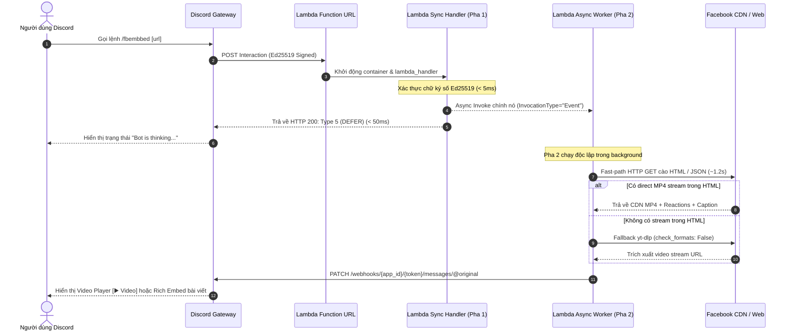

# FACEBOOK EMBED DISCORD BOT (SERVERLESS)
> Bot Discord tự động nhúng và trích xuất nội dung bài viết, video, Reels từ Facebook với kiến trúc Serverless trên AWS Lambda Function URL.

**Phiên bản:** 2.1.0  
**Ngày cập nhật cuối (Last Updated):** 2026-09-08  
**Runtime:** Python 3.12 (AWS Lambda x86_64)

---

## 1. CẤU TRÚC HỆ THỐNG (SYSTEM ARCHITECTURE)

Hệ thống hoạt động theo mô hình 2 pha (**Two-Phase Serverless Asynchronous Execution**) nhằm đáp ứng yêu cầu phản hồi tương tác trong vòng **3.0 giây** của Discord Gateway và tránh tình trạng container đóng băng (freezing):



### Các thành phần chính trong kiến trúc:
1. **Lambda Function URL (AuthType: NONE):** Đóng vai trò endpoint HTTPS công khai tiếp nhận Webhook tương tác từ Discord Developer Portal mà không qua API Gateway.
2. **Pha 1 - Synchronous Handshake (`< 100ms`):**
   - Xác thực chữ ký số bằng thuật toán Ed25519 (`pynacl.signing.VerifyKey`).
   - Phản hồi tức thì `Type 1` (PONG) khi Discord kiểm tra liveness handshake.
   - Khi nhận lệnh Slash Command (`Type 2`), gọi Self-Invoke bất đồng bộ (`InvocationType="Event"`) qua AWS SDK và trả về ngay phản hồi `Type 5` (DEFERRED_CHANNEL_MESSAGE_WITH_SOURCE) cho Discord.
3. **Pha 2 - Asynchronous Background Task (`1.2s - 2.5s`):**
   - **Fast-Path Extraction:** Sử dụng 1 HTTP GET request duy nhất để bóc tách thẻ OpenGraph, trích xuất chuỗi JSON GraphQL và tìm link CDN MP4 trực tiếp (`playable_url`, `browser_native_hd_url`).
   - **Fallback Engine:** Tự động fallback sang `yt_dlp` khi URL là video phức tạp mà Fast-Path không tìm thấy stream.
   - **Followup Delivery:** Gửi HTTP PATCH đến Discord Webhook (`@original`) để render trực tiếp trình phát Video HTML5 hoặc Rich Embed.

---

## 2. CẤU TRÚC THƯ MỤC DỰ ÁN (PROJECT STRUCTURE)

```text
Facebook_bot/
├── main.py                     # Entrypoint Lambda handler, xác thực chữ ký & bóc tách dữ liệu
├── app.py                      # Flask server phục vụ môi trường chạy thử nghiệm local
├── bot.py                      # Kịch bản đăng ký Slash Command /fbembbed lên Discord REST API
├── deploy.ps1                  # Kịch bản tự động hóa đóng gói và triển khai AWS Lambda qua AWS CLI
├── requirements-lambda.txt     # Danh sách thư viện tối giản đóng gói lên Lambda
├── requirements.txt            # Danh sách thư viện đầy đủ cho môi trường dev local
├── tests/                      # Thư mục kiểm thử tự động (Pytest Suite)
│   ├── __init__.py
│   ├── conftest.py             # Fixtures sinh khóa Ed25519 & mock biến môi trường
│   ├── test_fast_path.py       # Kiểm thử bóc tách Fast-Path & Fallback yt-dlp
│   ├── test_helpers.py         # Kiểm thử format số, thời gian, chunk văn bản, regex URL
│   ├── test_security_and_discord.py # Kiểm thử xác thực chữ ký số & routing HTTP
│   └── test_slash_command.py   # Kiểm thử xử lý interaction slash command
├── docs/                       # Thư mục tài liệu kỹ thuật
│   ├── UPDATE_PATCH.md         # Báo cáo chi tiết bản cập nhật tối ưu hóa v2.1.0
│   └── TEST_CASES.md           # Đặc tả chi tiết 44 test cases kiểm thử
└── embed_card/                 # Web component & Media Proxy phục vụ giao diện preview
```

---

## 3. HƯỚNG DẪN TRIỂN KHAI (DEPLOYMENT GUIDE)

### 3.1. Yêu cầu tiên quyết (Prerequisites)
1. **AWS CLI v2** đã được cài đặt và cấu hình chứng thực:
   ```powershell
   aws configure
   ```
2. Tệp `.env` tại thư mục gốc phải chứa đầy đủ thông tin:
   ```ini
   DISCORD_PUBLIC_KEY=your_discord_public_key_hex
   BOT_TOKEN=your_discord_bot_token
   APPLICATION_ID=your_discord_application_id
   ```

### 3.2. Thực thi triển khai tự động
Mở PowerShell tại thư mục gốc dự án và chạy:

```powershell
.\deploy.ps1
```

### 3.3. Các bước `deploy.ps1` tự động thực hiện:
* **Bước 1:** Kiểm tra tệp tin bắt buộc (`main.py`, `requirements-lambda.txt`, `.env`).
* **Bước 2:** Cài đặt dependencies vào thư mục tạm `build/` bằng pip với cờ `--platform manylinux2014_x86_64 --only-binary=:all:`.
* **Bước 3:** Đóng gói toàn bộ mã nguồn và thư viện thành tệp `function.zip`.
* **Bước 4:** Kiểm tra hoặc tự động tạo IAM Execution Role (`fb-embed-bot-role`) kèm quyền `AWSLambdaBasicExecutionRole` và chính sách Self-Invoke (`lambda:InvokeFunction`).
* **Bước 5:** Tạo mới hoặc cập nhật Lambda Function với cấu hình chuẩn:
  - **Runtime:** `python3.12`
  - **Memory:** `512 MB` (Tối ưu hóa CPU & throughput)
  - **Timeout:** `60 giây` (Chống ngắt kết nối giữa chừng)
* **Bước 6:** Cấu hình Async Event Invocation:
  - Thiết lập `MaximumRetryAttempts = 0` (Ngăn chặn bão retry gây nghẽn hàng đợi).
* **Bước 7:** Khởi tạo public Function URL với `AuthType=NONE` và thiết lập quyền truy cập công khai cho Discord Gateway.

Sau khi hoàn tất, script sẽ in ra URL công khai. Cung cấp URL này vào mục **Interactions Endpoint URL** trên Discord Developer Portal.

---

## 4. HƯỚNG DẪN KIỂM THỬ (TESTING GUIDE)

Hệ thống sử dụng `pytest` với 44 test cases tự động, không phụ thuộc vào kết nối mạng ngoài hay dữ liệu tĩnh:

```powershell
# Kích hoạt môi trường ảo và chạy toàn bộ kiểm thử
.\.venv\Scripts\pytest -v tests

# Kiểm tra độ bao phủ hoặc chạy riêng từng module
.\.venv\Scripts\pytest -v tests/test_fast_path.py
.\.venv\Scripts\pytest -v tests/test_security_and_discord.py
```

---

## 5. ĐĂNG KÝ SLASH COMMAND VỚI DISCORD

Để đăng ký hoặc cập nhật Slash Command `/fbembbed` với Discord API, chạy:

```powershell
.\.venv\Scripts\python bot.py
```
Lệnh sẽ gửi cấu trúc schema JSON lên Discord REST API v10 và trả về mã `200/201`.
