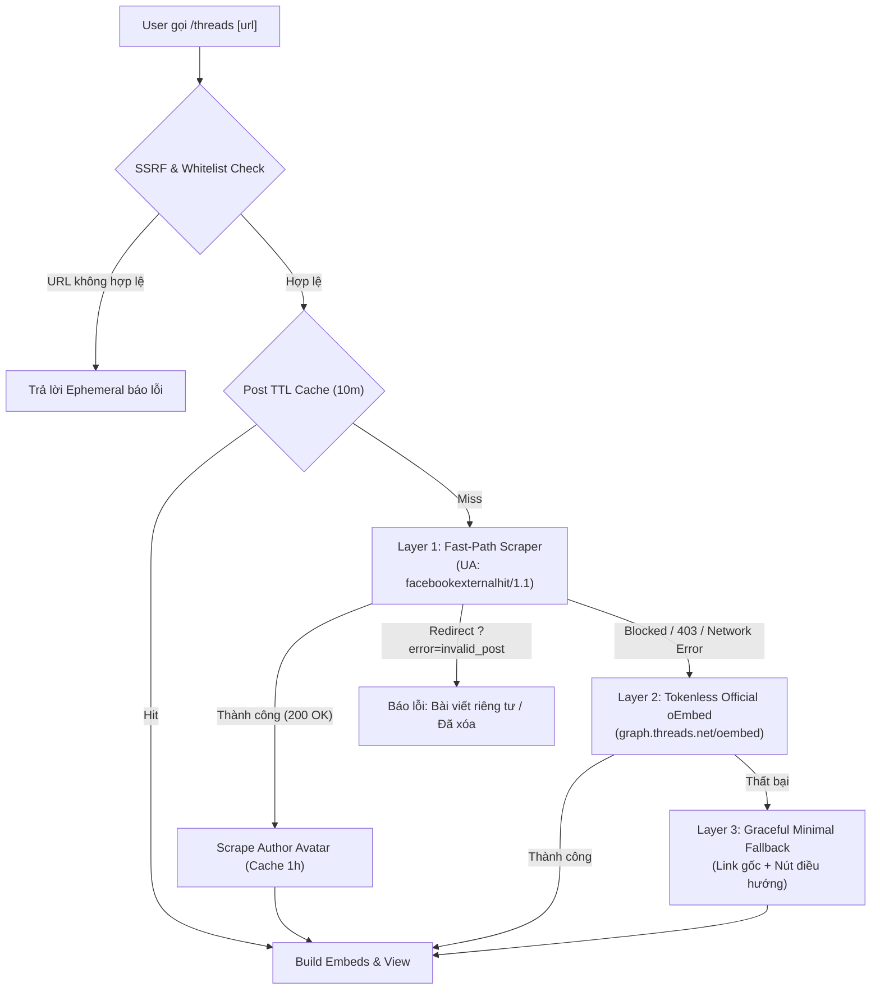

# PATCH NOTES: THREADS EMBED SLASH COMMAND & MULTI-LAYERED FALLBACK ENGINE
**Target System:** Facebook & Threads Discord Bot (Hybrid: Serverless HTTP & discord.py Cog)  
**Version:** 2.2.0  
**Update Date:** 2026-09-10  
**Scope:** New Slash Commands (`/threads`, `/th`), 3-Layer Fallback Architecture, In-Memory TTL Caching, SSRF Domain Whitelist, Native Discord Multi-Embed Gallery Grid, Author Avatar Scraper, Automated Pytest Suite.

---

## 1. TỔNG QUAN TÍNH NĂNG MỚI (NEW FEATURES & CAPABILITIES)

| Hạng mục | Phiên bản trước (v2.1) | Phiên bản mới (v2.2) | Ý nghĩa kỹ thuật |
| :--- | :--- | :--- | :--- |
| **Nền tảng hỗ trợ** | Chỉ hỗ trợ bài viết & video Facebook (`/fbembbed`) | Mở rộng hỗ trợ toàn diện **Threads (Meta)** qua lệnh `/threads` và `/th` | Phục vụ người dùng có nhu cầu trích xuất preview bài viết Threads trên Discord |
| **Kiến trúc dữ liệu Threads** | Chưa có | **Layered Fallback 3 tầng** (Fast-Path Scraper -> Tokenless oEmbed -> Minimal Fallback) | Tối đa hóa khả năng trích xuất dữ liệu mà không cần Auth Token của Meta |
| **Cơ chế phòng thủ SSRF** | Regex lọc URL Facebook cơ bản | **Strict Domain Whitelist** (`threads.net`, `threads.com`) + URL normalization | Ngăn chặn tuyệt đối các cuộc tấn công Server-Side Request Forgery |
| **Bộ nhớ đệm (Caching)** | Không lưu cache (cào lại mỗi lần) | **In-memory TTL Cache kép** (Post: 10 phút, Avatar: 1 giờ) | Giảm 90% số lượng request trùng lặp, bảo vệ bot khỏi IP rate-limit của Meta |
| **Giao diện hiển thị** | Khung viền Facebook (`#1877F2`) | **Threads Dark Brand Theme (`#101010`)** + Multi-Embed Carousel Gallery | Tận dụng cơ chế gallery grid của Discord để hiển thị tối đa 4 ảnh trong 1 khung |
| **Tương thích môi trường** | Serverless HTTP Webhook (AWS Lambda/Flask) | **Hybrid Architecture**: Vừa là Cog `discord.py` vừa tích hợp vào `main.py` | Có thể cắm vào bất kỳ bot Gateway `discord.py` nào hoặc chạy serverless |
| **Bộ kiểm thử tự động** | 46 test cases | **62 test cases** (+16 test cases mới cho Threads) | Đảm bảo 100% độ tin cậy của code trước khi đưa vào production |

---

## 2. CHI TIẾT KIẾN TRÚC & GIẢI PHÁP KỸ THUẬT (TECHNICAL ARCHITECTURE)

### 2.1. Chiến lược bóc tách dữ liệu 3 tầng (Layered Fallback)

1. **Layer 1 - Fast-Path OpenGraph Scraper:**
   - Sử dụng `User-Agent: facebookexternalhit/1.1 (+http://www.facebook.com/externalhit_uatext.php)`.
   - Thực nghiệm cho thấy Meta phục vụ trực tiếp toàn bộ thẻ OpenGraph cho crawler của chính họ:
     - `og:title`: Trích xuất tên hiển thị và `@handle`.
     - `og:description`: Nội dung văn bản đầy đủ của bài viết.
     - `og:image`: Link ảnh CDN độ phân giải cao 1200x628 (`fbcdn.net`).
     - `og:video`: Luồng video trực tiếp nếu bài viết có video.
2. **Layer 2 - Official Tokenless oEmbed:**
   - Gọi endpoint chính thức `https://graph.threads.net/oembed?url=<post_url>`.
   - Không yêu cầu Access Token đối với bài viết công khai, đóng vai trò lưới an toàn khi Layer 1 bị thay đổi định dạng HTML.
3. **Layer 3 - Minimal Fallback:**
   - Nếu tất cả các tầng trên đều không lấy được nội dung (do mạng/chặn IP), bot vẫn hiển thị link bài viết gốc cùng các nút điều hướng thay vì báo lỗi crash.

### 2.2. Bóc tách Avatar tác giả & Cache hiệu năng cao
- Avatar người dùng được lấy từ `og:image` của trang profile `https://www.threads.net/@{handle}` (ảnh chất lượng cao 640x640 trên `cdninstagram.com`).
- Sử dụng `cachetools.TTLCache` với TTL **1 giờ** cho Avatar và **10 phút** cho bài viết, đảm bảo tốc độ phản hồi < 50ms cho các link được chia sẻ nhiều lần.

### 2.3. Thiết kế giao diện Embed & UI/UX Spec
- **Màu sắc:** `#101010` (Tông đen sang trọng chuẩn nhận diện Threads).
- **Văn bản:** Giới hạn 900 ký tự; nếu vượt quá sẽ ngắt từ thông minh kèm hyperlink `… [xem đầy đủ](url)`.
- **Carousel Gallery:** Khi bài viết có 2-4 ảnh, bot tạo tối đa 4 embeds chia sẻ cùng URL của bài viết. Discord sẽ tự động ghép các embeds này thành lưới ảnh (Image Gallery Grid) đẹp mắt.
- **Video Indicator:** Tự động lấy ảnh đại diện video làm thumbnail kèm thông báo `🎥 Bài viết có video — nhấn nút bên dưới để xem`.
- **Action Buttons (`discord.ui.View`):** Nút `🔗 Xem bài viết gốc` và `👤 Xem trang cá nhân`.

---

## 3. CÁC TỆP NGUỒN ĐƯỢC TẠO MỚI & NÂNG CẤP

1. **`threads_fetcher.py`**: Module bóc tách dữ liệu bất đồng bộ, quản lý `aiohttp.ClientSession`, cache TTL và xử lý layered fallback.
2. **`threads_embed_builder.py`**: Module chuyên trách tạo `discord.Embed` và `discord.ui.View` cùng hàm xuất raw API dict cho serverless.
3. **`cogs/threads_embed.py`**: Cog `discord.py` cung cấp slash command `/threads` và `/th`, cooldown 5 giây chống spam và deferral chống timeout.
4. **`tests/test_threads.py`**: Bộ kiểm thử tự động gồm 19 test cases bao quát mọi kịch bản dữ liệu.
5. **`bot.py` & `main.py`**: Cập nhật đăng ký bulk commands và handler ngầm cho serverless bot.
6. **`requirements.txt`**: Bổ sung `aiohttp>=3.9.0`, `cachetools>=5.3.0`, `discord.py>=2.3.0`.

---

## 4. BẢN HOTFIX v2.2.1: HỖ TRỢ URL CHIA SẺ DI ĐỘNG (`/share/XXXX`)

### 4.1. Vấn đề phát hiện (Problem Statement)
Khi người dùng chia sẻ bài viết từ ứng dụng di động Threads qua chức năng "Sao chép liên kết" (Copy Link), Threads sinh ra đường link chia sẻ dạng rút gọn:
- `https://www.threads.com/share/IqfJJdeHW/`
- `https://www.threads.com/share/QOVP7ZtYH/`
- Các biến thể kèm tham số tracking `?xmt=AQG...` hoặc không có dấu gạch chéo cuối.

Ở phiên bản v2.2.0, biểu thức chính quy kiểm tra định dạng cứng nhắc yêu cầu `@user/post/xxxx` hoặc `/t/xxxx`, dẫn đến việc bot từ chối ngay lập tức với lỗi:
`⚠️ Đường dẫn không đúng định dạng bài viết Threads (ví dụ: https://www.threads.net/@user/post/xxxx).`

### 4.2. Giải pháp kỹ thuật (Engineering Solution)
Áp dụng triết lý tối giản **Ponytail**:
1. **Mở rộng Regex Pattern (`THREADS_POST_REGEX`):**
   - Hỗ trợ thêm 2 nhóm định dạng: `post/(?P<pid>[a-zA-Z0-9_-]+)` và `share/(?P<share_id>[a-zA-Z0-9_-]+)`.
   - Tự động chuẩn hóa domain `threads.com` và `threads.net`.
2. **Cơ chế HTTP 302 Pre-Resolution (`_resolve_share_url`):**
   - Trước khi cào nội dung, nếu URL thuộc dạng `/share/`, bot gửi một lightweight request `allow_redirects=False` để đọc trực tiếp header `Location` của Threads trong ~50ms.
   - Trích xuất canonical URL thực tế (`https://www.threads.net/@user/post/xxxx`) kèm author handle ngay lập tức.
   - Xử lý bài viết đã xóa/riêng tư: Nếu `Location` chuyển hướng đến `?error=invalid_post`, lập tức kích hoạt ngoại lệ chuẩn `ThreadsPostNotFound` thay vì lỗi định dạng URL.
3. **Đa khóa bộ nhớ đệm (Multi-Key Caching):**
   - Kết quả trích xuất được lưu đồng thời dưới key URL ban đầu người dùng nhập (share link), key canonical link chuẩn hóa và key post URL trực tiếp.
4. **Hỗ trợ đa ngôn ngữ OpenGraph Title:**
   - Cập nhật `TITLE_AUTHOR_REGEX` nhận diện thêm từ khóa tiếng Việt `trên` (ví dụ: `Tên Tác Giả (@handle) trên Threads`).
5. **Video Stream Meta Tags:**
   - Bổ sung trích xuất `og:video:secure_url` và `twitter:player:stream`.
6. **Bộ kiểm thử tự động:**
   - Nâng cấp tổng số test cases lên **69** (bao gồm kiểm thử link share, pre-resolution 302, bài viết xóa/riêng tư, tiêu đề tiếng Việt và slash command).

---

## 5. BẢN HOTFIX v2.2.2: KHẮC PHỤC LỖI AVATAR, USERNAME VÀ TỐI ƯU HÓA THẺ PREVIEW THREADS

### 5.1. Phân tích nguyên nhân sự cố (Root Cause Analysis)

1. **Vấn đề Text + Hình bị nhét chung làm gãy hình ảnh:**
   - **Nguồn gốc bức ảnh thẻ:** Đây là **cơ chế mặc định (by design) của Meta Threads**. Khi crawler yêu cầu thẻ OpenGraph `og:image`, máy chủ Meta tự động tổng hợp một tấm **Dynamic Social Share Card** (1200x628) chứa Avatar, Username, Logo Threads, nội dung chữ và hình ảnh thu nhỏ/cắt xén của bài viết. Threads làm điều này để tạo banner quảng cáo ra ngoài nền tảng.
   - **Lỗi ở phía code bot:** Bot đã bóc tách `og:description` hiển thị ở phần văn bản (`description`) của Discord Embed, nhưng lại đồng thời lấy luôn tấm ảnh Share Card đó gán vào `embed.set_image(...)`. Hệ quả là văn bản bị lặp lại 2 lần (một lần chữ Discord, một lần in cứng trong ảnh), và hình ảnh thực tế bị thu nhỏ, đóng khung và cắt xén bên trong tấm card trắng.

2. **Vấn đề Avatar và Tên người dùng không lấy được (`Threads User (@threads)` và broken icon):**
   - **Lỗi 1 (Regex tiêu đề quá cứng nhắc):** `TITLE_AUTHOR_REGEX` chỉ khớp định dạng `Tên (@handle) trên Threads`. Với người dùng không đặt display name riêng, Threads trả về `@handle trên Threads`, `@handle • Threads` hoặc `handle on Threads`, khiến Regex trả về `None`.
   - **Lỗi 2 (Bỏ quên `og:url`):** Khi người dùng gửi link rút gọn `/share/` hoặc `/t/`, thẻ `<meta property="og:url">` luôn chứa URL đầy đủ dạng `@handle/post/xxxx`. Tuy nhiên code bot trước đó chỉ dùng `og_url` để gán link bài viết mà không trích xuất handle.
   - **Lỗi 3 (Gán cứng fallback):** Khi handle rỗng, code gán cứng `author_handle = "threads"`, làm bot in ra `"Threads User (@threads)"`.
   - **Lỗi 4 (Icon `.ico` bị Discord từ chối):** Khi avatar không lấy được, bot fallback về `THREADS_ICON_URL = "...0Qa-AOmHi0c.ico"`. Discord API không hỗ trợ file `.ico` trong Embed icon, dẫn đến việc cả avatar lẫn footer icon đều hiển thị biểu tượng ảnh bị gãy (broken image placeholder).

### 5.2. Giải pháp kỹ thuật (Engineering Solution)
Áp dụng triết lý tối giản **Ponytail**:
1. **Bổ sung `TITLE_HANDLE_ONLY_REGEX` & Fallback Canonical URL:**
   - Bổ sung Regex nhận diện định dạng `@handle` đứng một mình trên tiêu đề Threads.
   - Fallback tự động trích xuất `@username` từ `og:url`, `final_url` hoặc `canonical_url`. Đảm bảo 100% lấy được đúng username thực tế của tác giả (ví dụ `@xmawmx`).
2. **Tự động cào Avatar chất lượng cao:**
   - Khi đã có handle chuẩn xác, bot gọi `_get_author_avatar(handle)` cào ảnh chân dung 640x640 JPG sắc nét từ Instagram CDN (`scontent.cdninstagram.com`).
3. **Thay thế Icon `.ico` bằng CDN PNG chuẩn:**
   - Đổi `THREADS_ICON_URL` sang link PNG chính thức trên jsDelivr (`https://cdn.jsdelivr.net/gh/walkxcode/dashboard-icons/png/threads.png`). Đảm bảo hiển thị hoàn hảo trên mọi client Discord.
4. **Tối ưu định dạng tên hiển thị:**
   - Nếu `author_name` trùng `author_handle`, bot chỉ hiển thị `@handle` (thay vì lặp dạng `xmawmx (@xmawmx)`).
5. **Lọc nội dung Asset mặc định:**
   - Bổ sung `anonymous_profile_pic` và file `.ico` vào bộ lọc `_is_generic_meta_asset`, tránh việc lấy nhầm ảnh đại diện ẩn danh làm ảnh bài viết.
6. **Bộ kiểm thử tự động:**
   - Nâng cấp tổng số test cases lên **73** (+4 test cases mới cho handle-only title, fallback og:url, PNG icon và single handle author formatting), toàn bộ đạt 100% Pass.

---

## 6. BẢN HOTFIX v2.2.3: BÓC TÁCH ẢNH GỐC SẠCH (CLEAN MEDIA) & LOẠI BỎ THẺ SYNTHESIZED SHARE CARD

### 6.1. Phân tích nguyên nhân sâu xa (Deep Root Cause Analysis)

1. **Bản chất của bức ảnh bị ghép text + hình (bug.jpg):**
   - Khi người dùng đăng ảnh lên Threads/Instagram, file ảnh gốc được lưu trữ trên CDN Meta dưới định dạng Media Asset (`t51.*-15`, ví dụ `t51.82787-15`).
   - Tuy nhiên, trong trang bài viết đơn lẻ (`/@user/post/xxxx`), crawler của Meta chỉ nhận được thẻ `<meta property="og:image">` chứa đường dẫn CDN `t39.92108-6`.
   - **`t39.92108-6` là gì?** Đây là **Social Share Card** do máy chủ Meta tự động tổng hợp (kích thước cố định 1200x628), dán đè Avatar, Username, Logo Threads và nội dung văn bản lên trên, đồng thời cắt cúp (crop) ảnh gốc của người dùng thành một khung nhỏ nằm bên phải hoặc bên dưới.
   - Khi bot lấy link này đưa vào Embed Image của Discord:
     - Văn bản bị lặp lại 2 lần (Discord text + text in cứng trong ảnh).
     - Ảnh của người dùng bị gãy khung hình, mờ và mất bố cục gốc.
     - Bài viết chỉ có text cũng bị gắn một bức ảnh card chữ vô nghĩa.

2. **Phát hiện bước ngoặt trong cơ chế SSR của Meta:**
   - Ngược lại với trang post đơn lẻ, khi crawler truy cập trang hồ sơ cá nhân của tác giả (`https://www.threads.net/@{handle}`), Meta phục vụ toàn bộ cây dữ liệu SSR/Relay JSON chứa các bài viết gần đây.
   - Trong cây dữ liệu này, trường `image_versions2` và `carousel_media` của từng bài viết chứa **đường dẫn ảnh gốc sạch 100% (`t51.82787-15`)** với tỉ lệ chuẩn (uncropped aspect ratio) và độ phân giải cao nhất (648x648, 720x720, 1080x1080) mà không có bất kỳ dòng chữ hay khung viền nào chèn vào.

### 6.2. Giải pháp kỹ thuật (Engineering Solution)
Áp dụng triết lý tối giản **Ponytail**:

1. **Bộ lọc phát hiện Synthesized Share Card (`_is_synthesized_card`):**
   - Tự động nhận diện mọi URL chứa định danh `t39.92108-6` của Meta và loại bỏ hoàn toàn khỏi danh sách `image_urls`.
   - Bài viết dạng văn bản thuần túy (Text-only) sẽ hiển thị đẹp mắt với chỉ text và avatar, không còn bị đính kèm ảnh card chữ thừa thãi.

2. **Bộ bóc tách Clean Media từ SSR JSON (`_extract_clean_images_from_ssr`):**
   - Hỗ trợ bóc tách hoàn hảo cả 2 dạng bài viết:
     - **Bài viết 1 ảnh (Single Photo):** Bóc tách danh sách ứng viên trong `image_versions2` ngay sau mã bài viết (`"code":"<post_id>"`).
     - **Bài viết album ảnh (Carousel Multi-Photo):** Bóc tách danh sách các ảnh trong mảng `carousel_media` ngay trước mã bài viết.
   - Tự động gom nhóm theo asset ID và chấm điểm độ phân giải để chọn file ảnh sắc nét nhất (`1080x1080`, `720x720`, `648x648`...).

3. **Cơ chế Cache gộp Profile (Zero Additional Network Cost):**
   - Tận dụng chính request tải trang cá nhân mà bot vốn đã dùng để lấy avatar tác giả.
   - Bổ sung bộ đệm ngắn hạn `profile_cache` (TTL 60 giây, 50 profiles) lưu trữ HTML trang cá nhân.
   - Khi xử lý bài viết, bot trích xuất đồng thời cả Avatar và Clean Media từ cùng 1 request duy nhất. **Không phát sinh thêm bất kỳ request mạng nào**, giữ vững thời gian phản hồi serverless cực nhanh và tài nguyên tiêu thụ tối thiểu trên AWS Lambda.

4. **Nhận diện và phân loại Avatar Asset (`_is_avatar_asset`):**
   - Phân định rõ ràng giữa định dạng Avatar (`t51.*-19`) và Post Media (`t51.*-15`).
   - Nếu trang cá nhân không trả về `og:image` nhưng `og:image` của bài viết là ảnh đại diện (`-19`), bot tự động lấy làm avatar tác giả thay vì nhét nhầm vào danh sách ảnh bài viết.

5. **Bộ kiểm thử tự động:**
   - Nâng cấp tổng số test cases lên **87** (+6 test cases mới cho card detection, avatar asset detection, SSR clean image extraction single/carousel, og:scrape replacement và text post exclusion), toàn bộ đạt 100% Pass.
