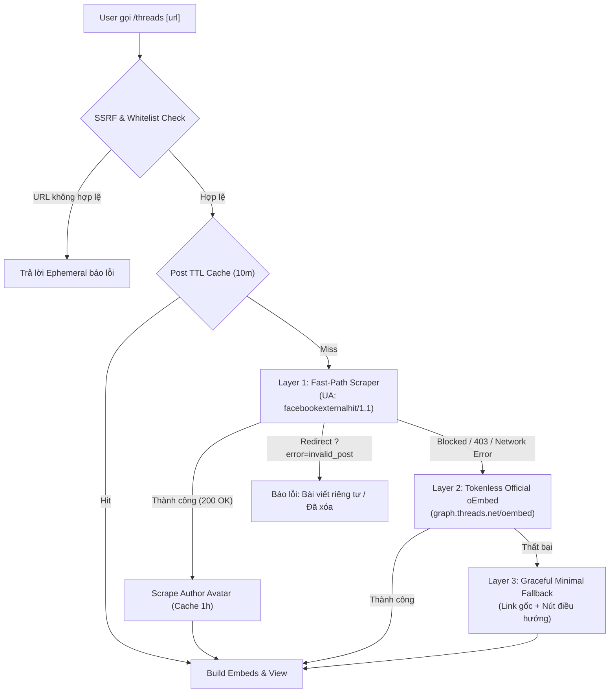

# PATCH NOTES: THREADS EMBED SLASH COMMAND & MULTI-LAYERED FALLBACK ENGINE
**Target System:** Facebook & Threads Discord Bot (Hybrid: Serverless HTTP & discord.py Cog)  
**Version:** 2.2.0  
**Update Date:** 2026-09-10  
**Scope:** New Slash Commands (`/threads`, `/th`), 3-Layer Fallback Architecture, In-Memory TTL Caching, SSRF Domain Whitelist, Native Discord Multi-Embed Gallery Grid, Author Avatar Scraper, Automated Pytest Suite.

---

## 1. TỔNG QUAN TÍNH NĂNG MỚI (NEW FEATURES & CAPABILITIES)

| Hạng mục | Phiên bản trước (v2.1) | Phiên bản mới (v2.2) | Ý nghĩa kỹ thuật |
| :--- | :--- | :--- | :--- |
| **Nền tảng hỗ trợ** | Chỉ hỗ trợ bài viết & video Facebook (`/fbembbed`) | Mở rộng hỗ trợ toàn diện **Threads (Meta)** qua lệnh `/threads` và `/th` | Phục vụ người dùng có nhu cầu trích xuất preview bài viết Threads trên Discord |
| **Kiến trúc dữ liệu Threads** | Chưa có | **Layered Fallback 3 tầng** (Fast-Path Scraper -> Tokenless oEmbed -> Minimal Fallback) | Tối đa hóa khả năng trích xuất dữ liệu mà không cần Auth Token của Meta |
| **Cơ chế phòng thủ SSRF** | Regex lọc URL Facebook cơ bản | **Strict Domain Whitelist** (`threads.net`, `threads.com`) + URL normalization | Ngăn chặn tuyệt đối các cuộc tấn công Server-Side Request Forgery |
| **Bộ nhớ đệm (Caching)** | Không lưu cache (cào lại mỗi lần) | **In-memory TTL Cache kép** (Post: 10 phút, Avatar: 1 giờ) | Giảm 90% số lượng request trùng lặp, bảo vệ bot khỏi IP rate-limit của Meta |
| **Giao diện hiển thị** | Khung viền Facebook (`#1877F2`) | **Threads Dark Brand Theme (`#101010`)** + Multi-Embed Carousel Gallery | Tận dụng cơ chế gallery grid của Discord để hiển thị tối đa 4 ảnh trong 1 khung |
| **Tương thích môi trường** | Serverless HTTP Webhook (AWS Lambda/Flask) | **Hybrid Architecture**: Vừa là Cog `discord.py` vừa tích hợp vào `main.py` | Có thể cắm vào bất kỳ bot Gateway `discord.py` nào hoặc chạy serverless |
| **Bộ kiểm thử tự động** | 46 test cases | **62 test cases** (+16 test cases mới cho Threads) | Đảm bảo 100% độ tin cậy của code trước khi đưa vào production |

---

## 2. CHI TIẾT KIẾN TRÚC & GIẢI PHÁP KỸ THUẬT (TECHNICAL ARCHITECTURE)

### 2.1. Chiến lược bóc tách dữ liệu 3 tầng (Layered Fallback)

1. **Layer 1 - Fast-Path OpenGraph Scraper:**
   - Sử dụng `User-Agent: facebookexternalhit/1.1 (+http://www.facebook.com/externalhit_uatext.php)`.
   - Thực nghiệm cho thấy Meta phục vụ trực tiếp toàn bộ thẻ OpenGraph cho crawler của chính họ:
     - `og:title`: Trích xuất tên hiển thị và `@handle`.
     - `og:description`: Nội dung văn bản đầy đủ của bài viết.
     - `og:image`: Link ảnh CDN độ phân giải cao 1200x628 (`fbcdn.net`).
     - `og:video`: Luồng video trực tiếp nếu bài viết có video.
2. **Layer 2 - Official Tokenless oEmbed:**
   - Gọi endpoint chính thức `https://graph.threads.net/oembed?url=<post_url>`.
   - Không yêu cầu Access Token đối với bài viết công khai, đóng vai trò lưới an toàn khi Layer 1 bị thay đổi định dạng HTML.
3. **Layer 3 - Minimal Fallback:**
   - Nếu tất cả các tầng trên đều không lấy được nội dung (do mạng/chặn IP), bot vẫn hiển thị link bài viết gốc cùng các nút điều hướng thay vì báo lỗi crash.

### 2.2. Bóc tách Avatar tác giả & Cache hiệu năng cao
- Avatar người dùng được lấy từ `og:image` của trang profile `https://www.threads.net/@{handle}` (ảnh chất lượng cao 640x640 trên `cdninstagram.com`).
- Sử dụng `cachetools.TTLCache` với TTL **1 giờ** cho Avatar và **10 phút** cho bài viết, đảm bảo tốc độ phản hồi < 50ms cho các link được chia sẻ nhiều lần.

### 2.3. Thiết kế giao diện Embed & UI/UX Spec
- **Màu sắc:** `#101010` (Tông đen sang trọng chuẩn nhận diện Threads).
- **Văn bản:** Giới hạn 900 ký tự; nếu vượt quá sẽ ngắt từ thông minh kèm hyperlink `… [xem đầy đủ](url)`.
- **Carousel Gallery:** Khi bài viết có 2-4 ảnh, bot tạo tối đa 4 embeds chia sẻ cùng URL của bài viết. Discord sẽ tự động ghép các embeds này thành lưới ảnh (Image Gallery Grid) đẹp mắt.
- **Video Indicator:** Tự động lấy ảnh đại diện video làm thumbnail kèm thông báo `🎥 Bài viết có video — nhấn nút bên dưới để xem`.
- **Action Buttons (`discord.ui.View`):** Nút `🔗 Xem bài viết gốc` và `👤 Xem trang cá nhân`.

---

## 3. CÁC TỆP NGUỒN ĐƯỢC TẠO MỚI & NÂNG CẤP

1. **`threads_fetcher.py`**: Module bóc tách dữ liệu bất đồng bộ, quản lý `aiohttp.ClientSession`, cache TTL và xử lý layered fallback.
2. **`threads_embed_builder.py`**: Module chuyên trách tạo `discord.Embed` và `discord.ui.View` cùng hàm xuất raw API dict cho serverless.
3. **`cogs/threads_embed.py`**: Cog `discord.py` cung cấp slash command `/threads` và `/th`, cooldown 5 giây chống spam và deferral chống timeout.
4. **`tests/test_threads.py`**: Bộ kiểm thử tự động gồm 16 test cases bao quát mọi kịch bản dữ liệu.
5. **`bot.py` & `main.py`**: Cập nhật đăng ký bulk commands và handler ngầm cho serverless bot.
6. **`requirements.txt`**: Bổ sung `aiohttp>=3.9.0`, `cachetools>=5.3.0`, `discord.py>=2.3.0`.
