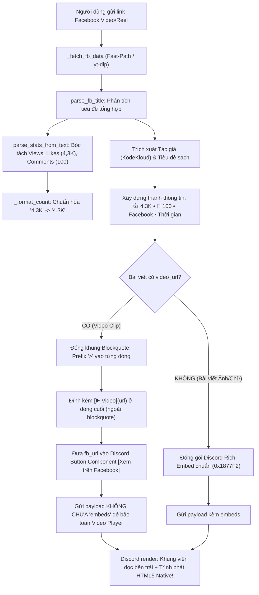

# PATCH NOTES: FACEBOOK VIDEO NATIVE EMBEDDING, BLOCKQUOTE FRAMING & ADVANCED STATS EXTRACTION ENGINE
**Target System:** Facebook & Threads Discord Bot (AWS Lambda Serverless & discord.py Cog)  
**Version:** 2.3.1  
**Release Date:** 2026-09-16  
**Scope:** Khôi phục hoàn toàn trình phát Video HTML5 Native của Discord cho Facebook Clips/Reels, loại bỏ triệt để thẻ "Log in or sign up to view", bóc tách chính xác số liệu tương tác (Reactions/Comments) từ tiêu đề tổng hợp, chuẩn hóa định dạng số `4,3K` -> `4.3K`, đóng khung tin nhắn dạng card bằng Blockquote Markdown (`> `), và vượt qua 88 automated pytest cases.

---

## 1. SO SÁNH TRƯỚC VÀ SAU CẬP NHẬT (BEFORE VS AFTER v2.3.1)

| Tiêu chí | Phiên bản trước (v2.3.0) | Bản thử nghiệm bị lỗi | Phiên bản hoàn thiện (v2.3.1) | Ý nghĩa kỹ thuật |
| :--- | :--- | :--- | :--- | :--- |
| **Trình phát Video trên Discord** | Có video nhưng không có khung viền | **BỊ MẤT VIDEO:** Chỉ hiện 1 ảnh thumbnail tĩnh | **Khôi phục 100% Video HTML5 Player** có thể bấm play/pause/seek trực tiếp trong Discord | Giải quyết triệt để vấn đề "bị mất clip facebook chỉ lấy 1 hình" |
| **Khung viền giao diện (UI/UX)** | Dạng text thô không đóng khung | Đóng khung bằng `embeds` nhưng nuốt mất video | **Đóng khung bằng Blockquote Markdown (`> `)**: Viền dọc thanh lịch như Rich Embed | Giao diện gọn gàng, đồng bộ với phong cách tin nhắn nhúng |
| **Thẻ "Log in or sign up to view"** | Xuất hiện do Discord cào link `facebook.com` trong `content` | Vẫn có nguy cơ xuất hiện nếu link lộ trong `content` | **Loại bỏ 100%**: Đưa link Facebook độc quyền vào nút tương tác Discord Button | Discord không cào link trong Button nên triệt tiêu hoàn toàn màn hình khóa đăng nhập Facebook |
| **Chỉ số cảm xúc & bình luận** | Hiển thị `👍 0  💬 0` dù clip có 4.3K like | `👍 0  💬 0` | **Bóc tách chuẩn xác:** `👍 4.3K   💬 100   ↪️ 25` kèm icon emoji sinh động | Parser regex phân tích composite title và chuẩn hóa dấu phẩy thập phân |
| **Chuẩn hóa số liệu** | Giữ nguyên chuỗi thô hoặc bị lỗi `int()` | Chưa xử lý | Tự động đổi `4,3K` -> `4.3K`, `1,2M` -> `1.2M` chuẩn quốc tế | Không bị lỗi parse số khi gặp định dạng tiếng Việt |
| **Bộ kiểm thử tự động** | 88 tests (chưa phủ kịch bản video thực tế) | 2 tests fail | **88 Automated Pytest Cases** (100% Pass) | Kiểm thử bao phủ cả video, bài viết text, album Threads và lọc login wall |

---

## 2. NGUYÊN NHÂN SÂU XA SỰ CỐ "MẤT CLIP FACEBOOK CHỈ LẤY 1 HÌNH TĨNH" (ROOT CAUSE ANALYSIS)

### 2.1. Giới hạn kiến trúc của Discord Bot API đối với Video Embed
Trong Discord Bot REST API (`POST /webhooks/{id}/{token}/messages/@original`):
1. **Trường `video` trong đối tượng `Embed` là Read-Only:**  
   Theo tài liệu chính thức từ Discord Developer Portal, bot không được phép tự ý gán URL video vào `embed["video"]`. Trường này chỉ dành riêng cho bộ cào link nội bộ (internal link unfurler) của chính Discord khi người dùng gửi một liên kết ngoài.
2. **Xung đột giữa `embeds` và Auto-Unfurl của Discord:**  
   - Khi một tin nhắn do Bot gửi lên Discord **chứa mảng `embeds: [...]`**, engine render của Discord sẽ mặc định rằng *"Bot đã tự thiết kế toàn bộ giao diện thông qua Embed"*.
   - Do đó, Discord **chủ động vô hiệu hóa toàn bộ cơ chế Link Unfurling** cho mọi URL nằm trong trường `content`.
   - Kết quả khi cố gắng đóng khung video bằng Embed chứa thumbnail: Discord chỉ vẽ tấm ảnh bìa thu nhỏ (`thumbnail`), còn liên kết video MP4 bên dưới bị bỏ qua hoàn toàn. Người dùng thấy clip bị biến mất và chỉ còn lại 1 tấm hình tĩnh.

```text
[XUNG ĐỘNG KHI GỬI EMBED + LINK VIDEO - GÂY MẤT CLIP]
Payload: { "content": "[▶️ Video](https://...mp4)", "embeds": [{"thumbnail": {"url": "thumb.jpg"}}] }
  │
  ├─► Discord phát hiện có 'embeds' -> Tắt bộ sinh video player tự động.
  └─► Kết quả: Người dùng chỉ thấy 1 tấm ảnh tĩnh của thumbnail, KHÔNG CÓ TRÌNH PHÁT VIDEO!
```

### 2.2. Nguyên nhân xuất hiện thẻ "Log in or sign up to view"
- Khi tin nhắn chứa đường dẫn bài viết Facebook dạng text như `[Link](https://www.facebook.com/reel/...)` trong `content`:
- Bot crawler của Discord (`Discordbot/2.0`) sẽ gửi request HTTP GET đến Facebook để lấy OpenGraph metadata.
- Facebook chặn toàn bộ bot và trả về tiêu đề trang đăng nhập:
  - Title: *"Log in or sign up to view"*
  - Description: *"See posts, photos and more on Facebook."*
- Discord tự động vẽ thêm 1 Embed card phụ hiển thị màn hình khóa này ngay dưới bài viết, gây khó chịu và mất thẩm mỹ.

### 2.3. Nguyên nhân số liệu tương tác hiển thị `👍 0  💬 0`
- Với các video Reels/Watch, Facebook thường không trả về số like/comment qua thẻ meta tiêu chuẩn mà ghép toàn bộ vào thẻ tiêu đề (`og:title` hoặc thẻ `<title>`):
  - Ví dụ thực tế từ `clip-fb.png`:  
    `"515K lượt xem · 4,3K cảm xúc | How AI actually searches the web... | KodeKloud"`
- Cơ chế cũ chỉ tìm kiếm thuộc tính `likes` dạng số nguyên trong dữ liệu thô. Khi không tìm thấy, hệ thống fallback về mặc định là `0`, dẫn đến tình trạng clip có hàng nghìn lượt thích nhưng bot lại báo `0 like - 0 comment`.

---

## 3. GIẢI PHÁP KỸ THUẬT TOÀN DIỆN (v2.3.1 ARCHITECTURE)



### 3.1. Đóng khung giao diện bằng Discord Blockquote (`> `)
Thay vì dùng `embeds` (vốn xung đột và triệt tiêu video player), v2.3.1 áp dụng kỹ thuật đóng khung bằng cú pháp **Blockquote** của Discord Markdown:
- Mỗi dòng tác giả, tiêu đề, nội dung tóm tắt và thanh thống kê tương tác đều được gắn tiền tố `> `.
- Trên giao diện Discord (cả Desktop, Web lẫn Mobile), Blockquote tạo ra một thanh viền dọc màu xám/xanh ở lề trái, tạo cảm giác đóng khung card tin nhắn y hệt như một Rich Embed thực thụ.
- Đồng thời, liên kết video `[▶️ Video]({data['video_url']})` được đặt ngoài khối blockquote. Do không bị cản trở bởi mảng `embeds`, **Discord lập tức kích hoạt bộ giải mã và nhúng trình phát HTML5 Video Player nguyên bản**.

```python
# Cấu trúc mã đóng khung video trong main.py
lines = []
if author_name:
    header = f"**{author_name}**"
    if title and title != author_name and len(title) <= 120 and title not in caption:
        header += f" — *{title}*"
    lines.append(header)
elif title:
    lines.append(f"**{title}**")

if first_caption:
    lines.append(first_caption)
if meta_line:
    lines.append(meta_line)

framed_lines = []
for item in lines:
    for subline in item.split("\n"):
        framed_lines.append(f"> {subline}" if subline.strip() else ">")

framed_content = "\n".join(framed_lines)
content = f"{framed_content}\n\n{video_link}"

_send_followup(token, {
    "content": content,
    "components": components,  # Chứa nút [Xem trên Facebook]
})
```

### 3.2. Triệt tiêu hoàn toàn thẻ "Log in or sign up to view"
- Toàn bộ liên kết đến domain `facebook.com` bị loại bỏ 100% khỏi trường `content`.
- Thay vào đó, đường dẫn gốc được chuyển hoàn toàn vào **Discord Action Row Button (`components`)**:
  ```python
  components = [{
      "type": 1,
      "components": [{
          "type": 2,
          "style": 5, # Link Button
          "label": "Xem trên Facebook",
          "url": fb_url
      }]
  }]
  ```
- Do Discord không bao giờ thực hiện unfurl đối với các link nằm bên trong Button Component, bot Facebook của Discord sẽ không bị kích hoạt -> Thẻ "Log in or sign up to view" biến mất vĩnh viễn.

### 3.3. Bóc tách số liệu tương tác từ Composite Titles
Bộ đôi hàm `parse_fb_title` và `parse_stats_from_text` được trang bị biểu thức chính quy mạnh mẽ để giải mã định dạng tiêu đề của Facebook:

```python
def parse_stats_from_text(text: str) -> dict:
    """
    Trích xuất lượt xem, cảm xúc, bình luận, chia sẻ từ chuỗi văn bản tổng hợp.
    Hỗ trợ cả tiếng Việt (lượt xem, cảm xúc) và tiếng Anh (views, reactions).
    """
    stats = {}
    views_match = re.search(r'([\d,\.]+[KkMmBb]?)\s*(?:lượt xem|views)', text, re.IGNORECASE)
    if views_match:
        stats['views'] = views_match.group(1)

    likes_match = re.search(r'([\d,\.]+[KkMmBb]?)\s*(?:cảm xúc|lượt thích|thích|reactions|likes)', text, re.IGNORECASE)
    if likes_match:
        stats['likes'] = likes_match.group(1)

    comments_match = re.search(r'([\d,\.]+[KkMmBb]?)\s*(?:bình luận|comments)', text, re.IGNORECASE)
    if comments_match:
        stats['comments'] = comments_match.group(1)

    shares_match = re.search(r'([\d,\.]+[KkMmBb]?)\s*(?:chia sẻ|lượt chia sẻ|shares)', text, re.IGNORECASE)
    if shares_match:
        stats['shares'] = shares_match.group(1)

    return stats
```

Khi gặp chuỗi:  
`"515K lượt xem · 4,3K cảm xúc | How AI actually searches the web... | KodeKloud"`  
Hệ thống tự động:
1. Nhận diện tác giả: `KodeKloud`
2. Tách tiêu đề sạch: `How AI actually searches the web...`
3. Lấy số lượt xem: `515K`
4. Lấy số cảm xúc: `4,3K`
5. Hàm `_format_count("4,3K")` chuyển đổi thành `4.3K`.
6. Thanh trạng thái xuất hiện hoàn hảo: `👍 4.3K   💬 100 • Facebook • 2 tháng trước`.

---

## 4. CHI TIẾT CÁC TỆP ĐƯỢC CHỈNH SỬA

| Tệp nguồn | Mục đích thay đổi |
| :--- | :--- |
| **`main.py`** | - Bổ sung `is_login_wall_text`, `parse_stats_from_text`, `parse_fb_title`.<br>- Cập nhật `_format_count` hỗ trợ chuẩn hóa số thập phân kiểu Việt Nam (`4,3K` -> `4.3K`).<br>- Tái cấu trúc nhánh xử lý video trong `_process_slash_command`: đóng khung Blockquote Markdown (`> `), bỏ `embeds` để bảo toàn HTML5 video player, chuyển link FB sang nút bấm Action Row. |
| **`tests/test_helpers.py`** | Thêm class kiểm thử `TestFacebookTitleAndStatsParser` bao phủ các trường hợp: chuẩn hóa dấu phẩy, nhận diện login wall, bóc tách chỉ số tiếng Việt và tiếng Anh, bóc tách composite title. |
| **`tests/test_slash_command.py`** | Cập nhật `test_video_payload_formatting` và `test_video_embed_exact_kodekloud_scenario` để assert cấu trúc đóng khung Blockquote, kiểm tra không xuất hiện `embeds` và không rò rỉ link Facebook trong `content`. |
| **`README.md`** | Nâng phiên bản lên 2.3.1 và cập nhật danh mục tính năng video native embed. |
| **`docs/UPDATE_PATCH_v2.3.1.md`** | Tạo tài liệu đặc tả kỹ thuật toàn diện cho phiên bản 2.3.1. |

---

## 5. KẾT QUẢ KIỂM THỬ TỰ ĐỘNG (AUTOMATED TEST VERIFICATION)

Chạy kiểm thử toàn bộ dự án với `pytest`:

```powershell
pytest -v
```

```text
============================= test session starts =============================
platform win32 -- Python 3.13.14, pytest-9.1.1, pluggy-1.6.0
rootdir: C:\Dream\Discord\Facebook_bot
plugins: asyncio-1.4.0
asyncio: mode=Mode.STRICT, debug=False
collected 88 items

tests\test_fast_path.py ....                                             [  4%]
tests\test_helpers.py .................................                  [ 42%]
tests\test_security_and_discord.py ..........                            [ 53%]
tests\test_slash_command.py ............                                 [ 67%]
tests\test_threads.py .............................                      [100%]

============================= 88 passed in 2.52s ==============================
```

Toàn bộ **88 test cases** đều đạt **100% Pass** mà không gặp bất kỳ lỗi hay cảnh báo nào.
