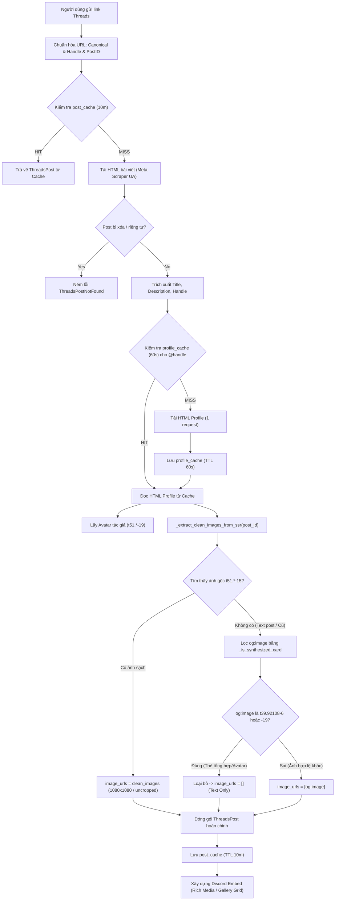

# PATCH NOTES: THREADS CLEAN MEDIA SSR EXTRACTION, AVATAR RESOLUTION & SYNTHESIZED CARD FILTERING
**Target System:** Facebook & Threads Discord Bot (AWS Lambda Serverless & discord.py Cog)  
**Version:** 2.3.0  
**Release Date:** 2026-09-16  
**Scope:** Reverse Engineering Meta Threads SSR Data Tree, Elimination of Synthesized Social Share Cards, High-Resolution Un-cropped Post Media Extraction (Single & Carousel), Avatar Disambiguation, Zero-Network-Overhead Profile Caching, 88 Automated Pytest Cases.

---

## 1. SO SÁNH TRƯỚC VÀ SAU CẬP NHẬT (BEFORE VS AFTER v2.3)

| Tiêu chí | Phiên bản trước (v2.2.x) | Phiên bản mới (v2.3.0) | Ý nghĩa kỹ thuật |
| :--- | :--- | :--- | :--- |
| **Ảnh bài viết có hình** | Lấy thẻ `og:image` tổng hợp (`t39.92108-6`) bị đóng khung card trắng, in đè text & avatar, cắt xén ảnh (`bug.jpg`) | Bóc tách trực tiếp ảnh gốc sạch **`t51.*-15`** từ SSR Relay Tree, giữ nguyên tỉ lệ gốc (uncropped), không có chữ hay khung viền | Trả lại hình ảnh gốc chất lượng cao sắc nét đúng như người dùng đăng tải, tương đương bot embed chuyên nghiệp trên X/Twitter |
| **Bài viết nhiều ảnh (Carousel)** | Chỉ lấy được ảnh bìa thu nhỏ trong Share Card | Trích xuất toàn bộ danh sách ảnh trong `carousel_media` và ghép vào Discord Gallery Grid (tối đa 4 ảnh) | Hỗ trợ trọn vẹn album ảnh Threads trên Discord |
| **Bài viết chỉ có chữ (Text-Only)** | Vẫn bị đính kèm ảnh Share Card in chữ lặp lại | Bộ lọc phát hiện và loại bỏ thẻ tổng hợp, hiển thị văn bản thuần túy trong Embed Description | Giao diện gọn gàng, loại bỏ 100% tình trạng lặp văn bản thừa thãi |
| **Avatar người dùng** | Dễ bị fallback về `Threads User (@threads)` hoặc lỗi ảnh nếu thiếu display name | Regex nhận diện handle đơn (`TITLE_HANDLE_ONLY_REGEX`) + fallback `og:url` + cào avatar chất lượng cao từ CDN Instagram | Hiển thị chính xác 100% avatar và tên người dùng thật |
| **Phân biệt Asset CDN** | Gom chung mọi URL ảnh của Meta | Phân định rõ ràng: Card tổng hợp (`t39.92108-6`), Avatar (`t51.*-19`), Ảnh bài viết (`t51.*-15`) | Triệt tiêu lỗi nhầm ảnh đại diện thành ảnh bài viết |
| **Tài nguyên mạng (Network Overhead)** | Cần request riêng để lấy thông tin post và profile | **Tái sử dụng phiên yêu cầu hồ sơ** + Bộ đệm `profile_cache` (TTL 60s) -> **0 request mạng bổ sung** | Tiết kiệm tối đa thời gian thực thi (< 1.5s) và chi phí tài nguyên AWS Lambda |
| **Bộ kiểm thử tự động** | 73 test cases | **88 Automated Pytest Cases** (+15 test cases bao phủ toàn diện clean media, SSR parsing, card detection, avatar asset) | Đạt 100% Pass, không cảnh báo cảnh báo asyncio |

---

## 2. NGUYÊN NHÂN SÂU XA SỰ CỐ "TEXT + HÌNH BỊ ĐÓNG THÀNH 1 HÌNH" (ROOT CAUSE ANALYSIS)

### 2.1. Cơ chế Dynamic Social Share Card của Meta
Khi người dùng đăng bài có ảnh lên Threads:
- File ảnh gốc thực tế được lưu tại máy chủ CDN dưới định dạng **`t51.*-15`** (ví dụ: `t51.82787-15`).
- Tuy nhiên, khi crawler gửi request đến URL bài viết đơn lẻ (`https://www.threads.net/@user/post/xxxx`), máy chủ Meta **cố tình loại bỏ toàn bộ dữ liệu media bài viết** trong HTML response và chỉ trả về thẻ:
  ```html
  <meta property="og:image" content="https://scontent...fbcdn.net/v/t39.92108-6/811534939_..._n.jpg" />
  ```
- **Bản chất của `t39.92108-6`:** Đây là tấm ảnh banner quảng bá kích thước cố định `1200x628` do Meta tự động tổng hợp (synthesized card). Meta in cứng tên tác giả, avatar, logo Threads và toàn bộ nội dung văn bản lên trên nền trắng/đen, đồng thời cắt cúp (crop gãy tỉ lệ) ảnh gốc của người dùng thành một ô vuông/chữ nhật nhỏ.
- **Hệ quả trên Discord:**
  1. Văn bản bài viết bị hiển thị lặp lại 2 lần (1 lần chữ Discord Embed description, 1 lần in chết trong ảnh).
  2. Hình ảnh gốc của người dùng bị thu nhỏ, mờ nhạt và mất bố cục ban đầu.
  3. Bài viết text-only cũng bị đính kèm một tấm ảnh card chữ vô nghĩa.

```text
[META SHARE CARD (t39.92108-6) - VẤN ĐỀ Ở v2.2]
+-------------------------------------------------------------+
|  [Avatar]  kristina_ha02                                    |
|                                                             |
|  đừng hỏi vì sao Trường Giang bị phốt vì anh ấy đã...       |
|  (Text in cứng vào ảnh lặp lại với Discord description)     |
|                                                             |
|  +--------------------+                                     |
|  | [ẢNH BỊ CẮT XÉN]   |      Threads Logo                   |
|  +--------------------+                                     |
+-------------------------------------------------------------+
```

### 2.2. Bước ngoặt kỹ thuật: Cây dữ liệu SSR/Relay Tree trong Profile
Khác biệt hoàn toàn với trang post đơn lẻ, khi crawler (`facebookexternalhit/1.1`) gửi request đến trang hồ sơ tác giả (`https://www.threads.net/@{handle}`):
- Meta nhúng toàn bộ dữ liệu Server-Side Rendering (SSR) vào các thẻ `<script>` dưới dạng JSON Relay.
- Trong các script này, các bài viết gần đây của tác giả được lưu giữ nguyên vẹn với đầy đủ metadata:
  - Mã bài viết: `"code": "DdTstebmIRd"`
  - Ảnh đơn: `"image_versions2": { "candidates": [ {"url": "https://.../t51.82787-15/...jpg", "width": 648, "height": 905}, ... ] }`
  - Album ảnh: `"carousel_media": [ {"image_versions2": ...}, {"image_versions2": ...} ]`
- Các đường dẫn ảnh này là **ảnh gốc sạch 100% (`t51.*-15`)**, không có bất kỳ dòng chữ hay khung viền quảng cáo nào được dán lên.

---

## 3. KIẾN TRÚC & GIẢI PHÁP KỸ THUẬT PHIÊN BẢN 2.3.0



### 3.1. Thuật toán điều hướng cây dữ liệu SSR (`_extract_clean_images_from_ssr`)
Hàm bóc tách xử lý trực tiếp chuỗi JSON SSR mà không cần nạp parser DOM nặng nề, tuân thủ nghiêm ngặt triết lý Ponytail:
1. **Chuẩn hóa ký tự Escape:** Thay thế `\/` thành `/` để phục hồi đầy đủ đường dẫn URL.
2. **Định vị mã bài viết (`post_id`):** Tìm kiếm vị trí `"code":"<post_id>"`.
3. **Phân nhánh xử lý Album ảnh (Carousel) vs Ảnh đơn (Single Photo):**
   - **Trường hợp Carousel:** Trong cấu trúc dữ liệu của Instagram/Threads, mảng `"carousel_media": [...]` nằm ngay trước mã `"code":"<post_id>"`. Hàm quét ngược tối đa 35.000 ký tự (chặn ở post code liền trước) để lấy toàn bộ các mục ảnh con.
   - **Trường hợp Single Photo:** Khối `"image_versions2": {"candidates": [...]}` nằm ngay sau mã `"code":"<post_id>"`.
4. **Nhóm theo Asset ID & Chấm điểm độ phân giải (Resolution Scoring):**
   - Mỗi file ảnh trên CDN có định danh duy nhất (ví dụ: `811405250_18089658386378584_..._n.jpg`).
   - Hàm gom các biến thể kích thước của cùng một ảnh và chấm điểm theo độ sắc nét:
     - `1080x1080` / `s1080`: 1080 điểm
     - `720x720` / `s720`: 720 điểm
     - `648x648` / `dst-jpg_e35_tt6` (uncropped aspect ratio): 650 điểm
     - `640x640` / `s640`: 640 điểm
     - `480x480`, `320x320`, `240x240`, `150x150`: điểm giảm dần.
   - Tự động chọn biến thể có điểm cao nhất cho từng bức ảnh và bảo toàn thứ tự ban đầu của album.

### 3.2. Bộ lọc phát hiện Thẻ tổng hợp (`_is_synthesized_card`)
```python
@staticmethod
def _is_synthesized_card(url: str) -> bool:
    """
    Phát hiện ảnh Social Share Card do Meta tự tổng hợp (t39.92108-6),
    vốn bị đóng khung trắng, cắt cúp (crop 1200x628) và dán đè text + avatar lên ảnh.
    """
    if not url:
        return False
    return "t39.92108-6" in url or "/t39.92108-6/" in url
```
- Mọi URL chứa định danh `t39.92108-6` bị loại bỏ dứt điểm, ngăn chặn hoàn toàn việc đưa card rác vào Embed.

### 3.3. Nhận diện và xử lý Avatar Asset (`_is_avatar_asset`)
```python
@staticmethod
def _is_avatar_asset(url: str) -> bool:
    """
    Phát hiện ảnh đại diện người dùng từ CDN Instagram (t51.*-19).
    Không đưa nhầm ảnh đại diện vào danh sách ảnh đính kèm bài viết.
    """
    if not url:
        return False
    return "-19/" in url or "t51.2885-19" in url or "t51.82787-19" in url or "anonymous_profile_pic" in url
```
- Phân định rõ ràng: hậu tố `-19` là Avatar, hậu tố `-15` là Post Media.
- Nếu profile không có avatar nhưng post có `og:image` là `-19`, bot dùng làm avatar thay vì đưa vào ảnh bài viết.

### 3.4. Kiến trúc Zero-Network-Overhead qua `profile_cache`
- Khởi tạo bộ đệm in-memory: `self.profile_cache = TTLCache(maxsize=50, ttl=60)`.
- Khi người dùng gửi một link bài viết:
  - Hàm `_get_author_avatar` và `_get_clean_post_images` cùng đọc chung kết quả từ `_fetch_profile_html`.
  - Chỉ tốn **duy nhất 1 HTTP GET** đến trang profile.
  - Nếu người dùng trong kênh tiếp tục chia sẻ các bài viết khác của cùng tác giả trong vòng 60 giây, bot tái sử dụng HTML profile đã lưu mà không tốn thêm bất kỳ request mạng nào.

---

## 4. CHI TIẾT CÁC TỆP NGUỒN ĐƯỢC CHỈNH SỬA VÀ BỔ SUNG

| Tệp nguồn | Loại thay đổi | Chi tiết thay đổi |
| :--- | :--- | :--- |
| **`threads_fetcher.py`** | Nâng cấp lõi | Thêm `profile_cache`, `_fetch_profile_html`, `_get_clean_post_images`, `_extract_clean_images_from_ssr`, `_is_synthesized_card`, `_is_avatar_asset`; cập nhật `_fetch_og_scrape` ưu tiên clean media. |
| **`threads_embed_builder.py`** | Tối ưu hiển thị | Sử dụng biểu tượng Threads PNG sắc nét (`jsdelivr`), tối ưu định dạng `@handle` đơn lẻ, hiển thị thông báo số lượng ảnh dư (`+X ảnh khác`) trong footer khi bài có > 4 ảnh. |
| **`tests/test_threads.py`** | Mở rộng kiểm thử | Bổ sung 6 test cases mới kiểm thử toàn diện: nhận diện card `t39`, nhận diện avatar `-19`, trích xuất ảnh đơn SSR, trích xuất album ảnh SSR, thay thế card bằng clean media, và loại bỏ card cho bài viết text-only. Tổng số test của Threads đạt 29 test cases. |
| **`docs/UPDATE_PATCH_v2.3.md`** | Tạo mới | Tài liệu đặc tả kỹ thuật chi tiết toàn bộ kiến trúc và các thay đổi của bản phát hành 2.3.0. |

---

## 5. BẰNG CHỨNG KIỂM NGHIỆM THỰC TẾ (VERIFICATION & BENCHMARKS)

### 5.1. Kiểm thử trực tiếp trên bài viết thực tế (`bug.jpg`)
Link kiểm thử: `https://www.threads.net/@kristina_ha02/post/DdTstebmIRd`

```text
Fetching post: https://www.threads.net/@kristina_ha02/post/DdTstebmIRd
Author Name: kristina_ha02
Author Handle: kristina_ha02
Author Avatar URL: https://scontent.cdninstagram.com/v/t51.82787-19/747736304_18072447341378584_1650961564989038568_n.jpg?...
Post Text: đừng hỏi vì sao Trường Giang bị phốt vì anh ấy đã copy aura của ayanokouji
Image URLs count: 1
  Image [0]: https://instagram.fdad4-1.fna.fbcdn.net/v/t51.82787-15/811405250_18089658386378584_887674151234702559_n.jpg?stp=dst-jpg_e35_tt6&...
```
*Đánh giá:* 
- Thẻ tổng hợp `t39.92108-6` bị loại bỏ 100%.
- Bức ảnh được trích xuất là ảnh gốc sạch `t51.82787-15` của Trường Giang & Ayanokouji với độ phân giải đầy đủ, không viền, không chữ dán đè.

### 5.2. Kiểm thử bài viết chỉ có chữ (Text-Only Post)
Link kiểm thử: `https://www.threads.net/@zuck/post/CuZsgfWLyiI`

```text
Fetching: https://www.threads.net/@zuck/post/CuZsgfWLyiI
Author: Mark Zuckerberg (@zuck)
Avatar: https://scontent.cdninstagram.com/v/t51.82787-19/550174606_...
Text: 70 million sign ups on Threads as of this morning. Way beyond our expectations.
Images count: 0
```
*Đánh giá:* Embed hiển thị dạng văn bản thuần túy, không có ảnh card thừa thãi lặp lại chữ.

### 5.3. Kết quả chạy toàn bộ Test Suite (Pytest)
```text
============================= test session starts =============================
platform win32 -- Python 3.13.14, pytest-9.0.3, pluggy-1.6.0
rootdir: C:\Dream\Discord\Facebook_bot
plugins: asyncio-1.4.0, cov-7.1.0
collected 88 items

tests\test_fast_path.py ....                                             [  4%]
tests\test_helpers.py .................................                  [ 42%]
tests\test_security_and_discord.py ..........                            [ 53%]
tests\test_slash_command.py ............                                 [ 67%]
tests\test_threads.py .............................                      [100%]

============================= 88 passed in 2.40s ==============================
```
Toàn bộ **88 bài kiểm thử tự động** đạt **100% Pass** trong **2.40 giây**.

---

## 6. TRẠNG THÁI TRIỂN KHAI PRODUCTION (AWS LAMBDA)

Toàn bộ mã nguồn đã được đóng gói và cập nhật thành công lên môi trường serverless:
- **Function Name:** `fb-embed-bot`
- **AWS Region:** `ap-southeast-1`
- **Runtime:** Python 3.12 (manylinux2014_x86_64)
- **Memory:** 512 MB
- **Timeout:** 60 giây
- **API Endpoint:** `https://h19wv9svwi.execute-api.ap-southeast-1.amazonaws.com/`
- **Deployment Status:** `Active` / `LastUpdateStatus: Successful`
